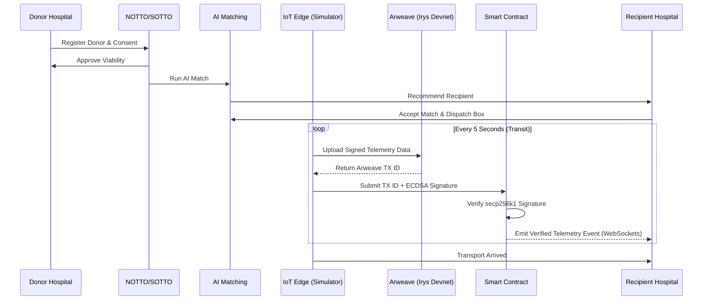

# 🫀 THOTA-Inspired Blockchain + IoT Organ Transport & Transplantation Platform

> **India-focused, THOTA-compliant, Event-Driven Organ Transplantation, AI Matching, IoT Cold-Chain Monitoring, and Immutable Blockchain Audit System.**

---

## 📌 Executive Overview

The **Organ Transport & Transplantation Platform** is a state-of-the-art medical logistics and audit ecosystem designed to eliminate organ trafficking, ensure strict regulatory compliance (THOTA - Transplantation of Human Organs and Tissues Act), enforce cold-chain integrity during organ transit, and guarantee 100% data immutability using an integrated Blockchain ledger.

### Key Pillars:
1. **Regulatory Governance & RBAC:** Multi-role access control for NOTTO/ROTTO/SOTTO Officers, Hospital Coordinators, Transplant Surgeons, and Transport Drivers.
2. **AI-Assisted Organ Matching:** Dynamic matching engine considering Blood Group compatibility, HLA typing, urgency score, geographical distance, pediatric prioritization, and waitlist time.
3. **Real-time IoT Telemetry:** Live sensor tracking (Temperature, Humidity, Battery, GPS Coordinates, Tamper/Lid Alerts) via ESP32 hardware or Virtual IoT Box Simulator.
4. **Immutable Blockchain Audit Trail:** Dual-adapter blockchain architecture (Mini-Ledger / Hyperledger Fabric) logging every state change from donor registration to recipient transplant completion.

---

## 🏗️ Architecture

The platform utilizes a modular **Monorepo** architecture powered by an **Event-Driven Architecture (EventBus)** that connects operational MongoDB databases with real-time WebSockets and an immutable Blockchain Ledger.

```text
               ┌────────────────────────────────────────────────────────┐
               │              React + Vite Web Dashboard                │
               └───────────────────────────┬────────────────────────────┘
                                           │ (HTTP REST / WebSockets)
                                           ▼
               ┌────────────────────────────────────────────────────────┐
               │               Express.js REST API Server               │
               └───────────────┬────────────────────────┬───────────────┘
                               │                        │
                    ┌──────────┴──────────┐   ┌─────────┴─────────┐
                    │  Central EventBus   │   │  MongoDB Storage  │
                    └──────────┬──────────┘   └───────────────────┘
                               │
       ┌───────────────────────┼───────────────────────┐
       ▼                       ▼                       ▼
┌──────────────┐       ┌──────────────┐        ┌──────────────┐
│  Blockchain  │       │  WebSocket   │        │     IoT      │
│  Subscriber  │       │ Broadcast    │        │ Telemetry    │
└──────┬───────┘       └──────────────┘        └──────┬───────┘
       │                                              ▲
       ▼                                              │ (HTTP Pings)
┌──────────────┐                              ┌───────┴───────┐
│ Ledger Blocks│                              │ ESP32 Box /   │
│ (Fabric/Mini)│                              │ Simulator     │
└──────────────┘                              └───────────────┘
```

### System Workflow Diagram (End-to-End)



### 🌐 Decentralized Telemetry & Irys Devnet Setup

This platform uses **Irys Devnet** to upload telemetry data directly to the Arweave Permaweb from the edge devices, ensuring immutable, decentralized audit trails that are cryptographically verified by the smart contract.

**Setup Instructions:**
1. Generate an Ethereum Private Key (or use an existing testnet wallet).
2. Set `IRYS_PRIVATE_KEY=your_private_key_here` in the `.env` file of the simulation or backend.
3. The simulator will automatically connect to `https://rpc.sepolia.org` and upload telemetry JSON objects.
4. Smart Contract verifies the ECDSA signature before persisting the `Arweave TX ID` to the ledger.


## 💻 Tech Stack

| Layer | Technology |
|---|---|
| **Frontend** | React 18, Vite, Vanilla CSS Modules, Lucide React, Recharts |
| **Backend** | Node.js (v24+), Express.js, EventBus (EventEmitter) |
| **Database** | MongoDB (Mongoose ORM) |
| **Blockchain** | Pluggable Architecture (Mini-Blockchain Adapter & Hyperledger Fabric Adapter) |
| **IoT / Hardware** | ESP32 Microcontroller (Wi-Fi/GPS/DHT11) & Virtual Node.js Simulator |
| **Authentication** | JWT (JSON Web Tokens), Bcrypt Password Hashing, RBAC |
| **API Testing** | Bruno API Collection |

---

## 📦 Directory Structure

```text
Organ-Transport-System/
├── backend/
│   ├── src/
│   │   ├── app.js                 # Express Application Setup
│   │   ├── server.js              # Server Listener & DB Initialization
│   │   ├── auth/                  # JWT Auth & User Controllers/Services
│   │   ├── hospital/              # Hospital Management Module
│   │   ├── donor/                 # Donor Registration & Consent Module
│   │   ├── organ/                 # Organ Medical Assessment & Viability
│   │   ├── recipient/             # Recipient Waitlist Module
│   │   ├── matching/              # AI Matching Engine
│   │   ├── transport/             # Mission & IoT Telemetry Module
│   │   ├── blockchain/            # MiniLedger & Hyperledger Adapters
│   │   ├── websocket/             # Real-time Telemetry Gateway
│   │   ├── middleware/            # Auth & RBAC Middleware
│   │   └── scripts/               # Seed & Automated E2E API Verification
│   └── package.json
├── frontend/
│   ├── src/
│   │   ├── components/            # Sidebar, Topbar, Status Badges
│   │   ├── pages/                 # Executive Overview, Map, Health, Audit, Matching, Simulator
│   │   ├── context/               # Auth & Socket Context Providers
│   │   └── services/              # Axios API Client
│   └── package.json
├── simulation/
│   └── iotSimulator.js            # CLI IoT Device Telemetry Generator
├── BrunoCollection/               # Bruno API Automation Test Suite
├── docker-compose.yml             # Local MongoDB & Services Configuration
└── README.md
```

---

## ⚙️ Installation & Setup

### Prerequisites
- **Node.js**: v18.x or higher (Tested on Node v24)
- **MongoDB**: Local MongoDB instance (`mongodb://localhost:27017`) or MongoDB Atlas
- **Git**

### Step-by-Step Installation

1. **Clone the Repository:**
   ```bash
   git clone https://github.com/your-username/Organ-Transport-System.git
   cd Organ-Transport-System
   ```

2. **Backend Setup:**
   ```bash
   cd backend
   npm install
   ```

3. **Configure Environment Variables:**
   Create a `.env` file inside the `backend/` directory:
   ```env
   PORT=5000
   NODE_ENV=development
   MONGODB_URI=mongodb://localhost:27017/organ_transport_system
   JWT_SECRET=super_secret_jwt_key_2026
   JWT_EXPIRES_IN=1d
   BLOCKCHAIN_ADAPTER=mini
   ```

4. **Frontend Setup:**
   ```bash
   cd ../frontend
   npm install
   ```

---

## 🚀 Running the Application

### 1. Start Backend Server
```bash
cd backend
npm run dev
```
*Server runs at `http://localhost:5000`*

### 2. Reset & Seed Database (Initial Setup)
```bash
cd backend
npm run seed:reset
```
*Populates sample Hospitals, Donors, Organs, Recipients, Transport Missions, and Initial Blockchain Blocks.*

### 3. Start Frontend Dashboard
```bash
cd frontend
npm run dev
```
*Dashboard runs at `http://localhost:5173`*

### 4. Run IoT Telemetry Simulator (CLI)
```bash
node backend/src/simulator/iotSimulator.js BOX-2026-FABRIC-ALPHA secret123 TRN-2026-001
```

### 5. Automated E2E API Test Verification
To verify the entire End-to-End journey via API calls:
```bash
cd backend
node src/scripts/e2e_api_test.js
```

---

## 📡 API Reference Summary

### Authentication (`/api/v1/auth`)
- `POST /api/v1/auth/register` — Register a new user with role.
- `POST /api/v1/auth/login` — Login and receive JWT access token.

### Hospital Management (`/api/v1/hospitals`)
- `POST /api/v1/hospitals` — Register hospital details and capabilities.
- `GET /api/v1/hospitals` — List all registered hospitals.
- `POST /api/v1/hospitals/:id/approve` — NOTTO Officer hospital authorization.

### Donor Management (`/api/v1/donors`)
- `POST /api/v1/donors` — Register new donor (Draft state).
- `POST /api/v1/donors/:id/submit` — Submit donor for review.
- `POST /api/v1/donors/:id/medical-approve` — Medical clearance.
- `POST /api/v1/donors/:id/consent-verify` — Family/Self consent verification.
- `POST /api/v1/donors/:id/activate` — Mark donor as AVAILABLE.

### Organ Assessment (`/api/v1/organs`)
- `POST /api/v1/organs` — Harvested organ registration.
- `POST /api/v1/organs/:id/begin-assessment` — Start viability test.
- `POST /api/v1/organs/:id/approve-viability` — Mark organ as AWAITING_ALLOCATION.

### AI Matching Engine (`/api/v1/matching`)
- `POST /api/v1/matching/organs/:organId/run` — Run algorithm & generate ranked recipient recommendations.
- `POST /api/v1/matching/:matchId/recipients/:recipientId/accept` — Accept top match match recommendation.

### Transport & Telemetry (`/api/v1/transport`)
- `POST /api/v1/transport/boxes` — Register Smart IoT Box.
- `POST /api/v1/transport/missions` — Create organ transport mission.
- `POST /api/v1/device/telemetry` — Device ping endpoint (Temperature, GPS, Tamper alerts).

### Blockchain Audit (`/api/v1/audit`)
- `GET /api/v1/audit/entity/organ/:organId` — Retrieve full immutable blockchain audit trail for an organ.
- `GET /api/v1/audit/blocks` — List all blocks in the ledger.

---

## 🗄️ Database Schemas Overview

- **User**: User ID, Name, Email, Password Hash, Role (`PLATFORM_ADMIN`, `NOTTO_OFFICER`, `HOSPITAL_COORDINATOR`, `TRANSPLANT_SURGEON`, `TRANSPORT_COORDINATOR`).
- **Hospital**: Code, Name, License Number, Type, GeoLocation (`Point`), Capabilities (`KIDNEY`, `LIVER`, `HEART`, `LUNGS`).
- **Donor**: Donor Type (`LIVING`, `DECEASED`), Blood Group, Age, Gender, Medical Summary, Consent Verification, State Machine Status.
- **Organ**: Organ ID, Organ Type, Donor Ref, Cold Ischemia Time Limit, Viability Metrics, Status.
- **Recipient**: Blood Group, Required Organ, Urgency Score, Medical Urgency Details, GeoLocation, Status.
- **Match**: Organ Ref, Recommendations List (Recipient ID, Total Score, Urgency Score, Distance Score, Pediatric Score), Status.
- **TransportBox**: Box ID, Device Secret Hash, Last Known Location, Temperature Bounds, Battery Level, Status.
- **TransportMission**: Mission ID, Organ Ref, Match Ref, Box Ref, Origin Hospital, Destination Hospital, Route GPS, Telemetry History.
- **LedgerBlock**: Index, Timestamp, Previous Hash, Hash, Entity Type, Entity ID, Action, Payload, Signature.

---

## 🔄 End-to-End System Workflow

```text
[ 1. Hospital Registration ] ──► [ 2. Donor Registration & Consent ]
                                              │
                                              ▼
[ 4. AI Matching Algorithm ] ◄── [ 3. Organ Harvest & Viability ]
             │
             ▼
[ 5. Match Acceptance ] ──► [ 6. IoT Transport Mission Activation ]
                                              │
                                              ▼
[ 8. Blockchain Ledger Audit ] ◄── [ 7. Live Telemetry & Cold-Chain Ping ]
```

1. **Hospital Verification**: NOTTO approves transplant-capable hospitals.
2. **Donor Onboarding**: Hospital Coordinator registers donor; consent is verified.
3. **Organ Harvest**: Organ viability is confirmed by Transplant Surgeon within Cold Ischemia time limit.
4. **AI Matching**: Algorithm ranks recipient waitlist based on clinical urgency, blood compatibility, distance, and pediatric status.
5. **Mission Creation**: Smart Transport Box is assigned; mission starts.
6. **Live Transit**: Box streams temperature, battery, and GPS coordinates; WebSockets update dashboard map.
7. **Blockchain Ledger**: EventBus emits events; Blockchain subscriber appends cryptographically hashed block for each milestone.

---

## 🔮 Future Scope & Roadmap

- [ ] **Hyperledger Fabric Production Network**: Full multi-peer network deployment with Raft consensus and Chaincode smart contracts.
- [ ] **Hardware ESP32 Integration**: Deploy physical ESP32 boxes with OLED display, DHT11 sensors, GPS module, and cellular SIM fallback.
- [ ] **Machine Learning Matching**: Train deep learning models on historical graft survival metrics to optimize matching scores.
- [ ] **Green Corridor GIS Routing**: Integration with Traffic Police GIS APIs for dynamic traffic signal light automation along transport routes.
- [ ] **Automated SMS & Email Alerts**: Real-time Twilio & SendGrid notifications for temperature threshold breaches or box tampering.

---

## 📄 License

This project is licensed under the **MIT License**.
