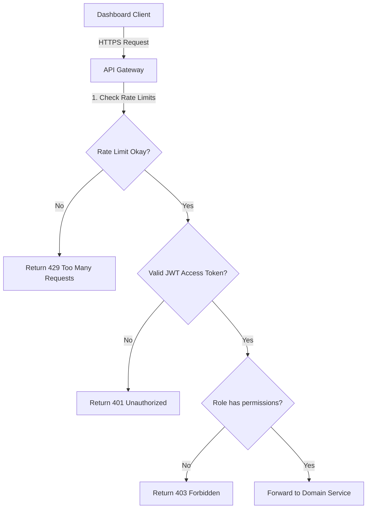
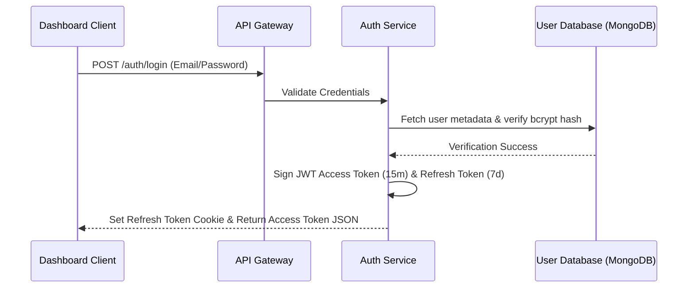

# REST API & WebSocket Specification
## Blockchain-Enabled Human Organ Transplantation & Smart Organ Transport Platform

This document describes the API design, security parameters, HTTP endpoints, payload definitions, and WebSocket events for the platform.

---

## 1. API Design Principles
The platform API follows RESTful conventions to ensure consistency and reliability:
*   **Stateless Operations**: No session states are kept on servers. Request validation uses JSON Web Tokens (JWTs).
*   **Predictable Status Codes**: Uses HTTP status codes (200, 201, 400, 401, 403, 404, 409, 500) to communicate call outcomes.
*   **Standard Payloads**: Every JSON response uses consistent schemas to simplify client-side integration.
*   **Granular Security**: Implements Role-Based Access Control (RBAC) at the gateway layer to validate requests before routing them to domain services.

---

## 2. Versioning Strategy
*   **Prefix**: All API paths are versioned using a prefix in the URL.
*   **Current Version**: `v1`
*   **Base URL Structure**: `https://api.organtransplant.org/api/v1`

---

## 3. Authentication & Authorization
*   **Token Model**: Employs stateless JSON Web Tokens (JWTs) for authorization.
*   **Authorization Header**: Clients must send the JWT token in the `Authorization` header using the Bearer scheme:
    ```http
    Authorization: Bearer <JWT_ACCESS_TOKEN>
    ```
*   **Token Lifecycles**:
    *   *Access Token*: Short-lived (15 minutes), verified in memory by services.
    *   *Refresh Token*: Long-lived (7 days), stored in an `HttpOnly`, `Secure`, `SameSite=Strict` cookie to prevent Cross-Site Scripting (XSS) access.

---

## 4. Response Standards

### Success (200 OK / 201 Created)
```json
{
  "success": true,
  "message": "Resource retrieved successfully",
  "data": {}
}
```

### Validation Error (400 Bad Request)
```json
{
  "success": false,
  "error": {
    "code": "VALIDATION_FAILED",
    "message": "Validation rules violated",
    "details": [
      {
        "field": "bloodType",
        "issue": "Blood type must match ABO/Rh pattern (e.g. O+, A-)"
      }
    ]
  }
}
```

### Unauthorized (401 Unauthorized)
```json
{
  "success": false,
  "error": {
    "code": "INVALID_TOKEN",
    "message": "Authorization token is missing, expired, or malformed"
  }
}
```

### Forbidden (403 Forbidden)
```json
{
  "success": false,
  "error": {
    "code": "ROLE_UNAUTHORIZED",
    "message": "Your role does not possess the permissions required for this resource"
  }
}
```

### Not Found (404 Not Found)
```json
{
  "success": false,
  "error": {
    "code": "RESOURCE_NOT_FOUND",
    "message": "The requested resource could not be located"
  }
}
```

### Conflict (409 Conflict)
```json
{
  "success": false,
  "error": {
    "code": "DUPLICATE_RESOURCE",
    "message": "A resource with the specified identifier already exists"
  }
}
```

### Internal Error (500 Internal Server Error)
```json
{
  "success": false,
  "error": {
    "code": "INTERNAL_SERVER_ERROR",
    "message": "An unexpected error occurred. Please contact the administrator"
  }
}
```

---

## 5. Endpoint Naming Conventions
*   **Plural Nouns**: Routes use plural nouns for collections (e.g., `/organs`, `/recipients`).
*   **Hyphenated Paths**: Sub-resources use hyphens for readability (e.g., `/transport-missions`).
*   **HTTP Verbs**: Operations use standard HTTP verbs:
    *   `GET`: Retrieve collections or individual items.
    *   `POST`: Create new resources.
    *   `PUT`: Overwrite existing records.
    *   `PATCH`: Apply partial modifications.
    *   `DELETE`: Deactivate or remove resources.

---

## 6. Pagination, Filtering, Sorting & Search
To minimize server memory usage, collection endpoints support standard query parameters:

### Pagination
*   `page`: The page offset index (default: `1`).
*   `limit`: Number of records returned per query (default: `10`, maximum: `100`).
*   **Response Envelope**:
    ```json
    "pagination": {
      "currentPage": 1,
      "totalPages": 5,
      "totalRecords": 48
    }
    ```

### Filtering
Clients filter records using query selectors:
*   `status=In_Transit` (Exact match)
*   `bloodType=O%2B` (URL encoded value)

### Sorting
*   `sortBy`: Name of the target field (e.g., `urgencyScore`).
*   `order`: Direction parameter, either `asc` or `desc`.

### Searching
*   `q`: Runs regex searches across indexed index fields (e.g., `q=Sharma`).

---

## 7. Error Handling Strategy
*   **Payload Sanitation**: The API Gateway sanitizes all payloads, preventing code injection or database execution failures.
*   **Gateway Error Logs**: Validation issues are caught and returned to clients immediately before routing to backend services, reducing computing overhead.
*   **System Tracking**: System logs are formatted as Winston JSON logs and saved to MongoDB for analysis.

---

## 8. API Flows (Mermaid Diagrams)

### 1. API Gateway Routing Flow


### 2. Authentication Flow


### 3. Organ Transport Verification Flow
```mermaid
sequenceDiagram
    participant Box as ESP32 Box
    participant IS as IoT Gateway
    participant BE as Backend Core
    participant BC as Blockchain Service
    participant HLF as Hyperledger Fabric

    Box->>IS: POST /api/v1/iot/telemetry (Temp, GPS, Tamper=True)
    IS->>BE: Dispatch Active Breach Alert
    BE->>BC: Invoke Audit Log Transaction
    BC->>HLF: Commit Incident (Block Committed)
    BE-->>Box: Return Alarm Action (Buzzer=Active)
```

---

## 9. API Reference Registry

---

### Module 1: Authentication

#### `POST /auth/login`
*   **Purpose**: Validates user credentials and returns active access tokens.
*   **Required Role**: Public (None).
*   **Authentication Required**: No.
*   **Request Body**:
    ```json
    {
      "email": "dr.sharma@aims.edu",
      "password": "SecurePassword123"
    }
    ```
*   **Response Body**:
    ```json
    {
      "success": true,
      "message": "Login successful",
      "data": {
        "accessToken": "eyJhbGciOiJIUzI1NiIsIn...",
        "user": {
          "email": "dr.sharma@aims.edu",
          "fullName": "Dr. Rajesh Sharma",
          "role": "Doctor"
        }
      }
    }
    ```
*   **Validation Rules**: Email must match standard regex patterns. Password is a required field.
*   **Possible Errors**: `400: VALIDATION_FAILED`, `401: INVALID_CREDENTIALS`.
*   **Related Database Collections**: `Users`, `Roles`.
*   **Blockchain Transaction**: No.

#### `POST /auth/refresh`
*   **Purpose**: Generates a new access token using a refresh cookie.
*   **Required Role**: Public.
*   **Authentication Required**: Yes (via Refresh Cookie).
*   **Request Body**: None (Uses Cookie values).
*   **Response Body**:
    ```json
    {
      "success": true,
      "data": {
        "accessToken": "eyJhbGciOiJIUzI1NiIsIn..."
      }
    }
    ```
*   **Possible Errors**: `401: REFRESH_TOKEN_EXPIRED`.
*   **Related Database Collections**: `Users`.
*   **Blockchain Transaction**: No.

---

### Module 2: Hospital Management

#### `POST /hospitals`
*   **Purpose**: Adds a new hospital to the system.
*   **Required Role**: Admin.
*   **Authentication Required**: Yes.
*   **Request Body**:
    ```json
    {
      "name": "Fortis Hospital",
      "code": "FORTIS-GGN",
      "address": "Sector 44, Gurugram, Haryana",
      "coordinates": [77.0725, 28.4592],
      "tier": "Tier-1",
      "contactPhone": "+91-124-4556677"
    }
    ```
*   **Response Body**:
    ```json
    {
      "success": true,
      "data": {
        "hospitalId": "60c72b2f9b1d8b2bad18a302"
      }
    }
    ```
*   **Validation Rules**: Hospital code must be unique. Coordinates require a valid longitude/latitude array.
*   **Possible Errors**: `409: DUPLICATE_RESOURCE`, `400: INVALID_COORDINATES`.
*   **Related Database Collections**: `Hospitals`.
*   **Blockchain Transaction**: Yes.

---

### Module 3: Doctor Management

#### `POST /doctors`
*   **Purpose**: Registers a doctor profile and associates it with a user account.
*   **Required Role**: Admin, Hospital_Coordinator.
*   **Authentication Required**: Yes.
*   **Request Body**:
    ```json
    {
      "userId": "60c72b2f9b1d8b2bad18a201",
      "hospitalId": "60c72b2f9b1d8b2bad18a300",
      "specialty": "Cardiology",
      "department": "Transplant Surgery"
    }
    ```
*   **Response Body**:
    ```json
    {
      "success": true,
      "data": {
        "doctorId": "60c72b2f9b1d8b2bad18a401"
      }
    }
    ```
*   **Validation Rules**: Both `userId` and `hospitalId` must exist.
*   **Possible Errors**: `404: USER_NOT_FOUND`.
*   **Related Database Collections**: `Doctors`, `Users`, `Hospitals`.
*   **Blockchain Transaction**: No.

---

### Module 4: Donor Management

#### `POST /donors`
*   **Purpose**: Registers a donor medical profile.
*   **Required Role**: Hospital_Coordinator, Doctor.
*   **Authentication Required**: Yes.
*   **Request Body**:
    ```json
    {
      "patientId": "60c72b2f9b1d8b2bad18a500",
      "donorType": "Brain_Dead",
      "causeOfDeath": "Trauma",
      "hlaType": "A2,B7,DR15",
      "consentingAuthority": "Next of Kin"
    }
    ```
*   **Response Body**:
    ```json
    {
      "success": true,
      "data": {
        "donorId": "60c72b2f9b1d8b2bad18a601"
      }
    }
    ```
*   **Possible Errors**: `400: INVALID_HLA_TYPE`, `404: PATIENT_NOT_FOUND`.
*   **Related Database Collections**: `Donors`, `Patients`.
*   **Blockchain Transaction**: Yes (consent record and donor type signature).

---

### Module 5: Recipient Management

#### `POST /recipients`
*   **Purpose**: Adds a patient to the active organ waiting list.
*   **Required Role**: Hospital_Coordinator.
*   **Authentication Required**: Yes.
*   **Request Body**:
    ```json
    {
      "patientId": "60c72b2f9b1d8b2bad18a500",
      "urgencyScore": 89.2,
      "hlaType": "A2,B8,DR15",
      "preferredHospitalId": "60c72b2f9b1d8b2bad18a300"
    }
    ```
*   **Response Body**:
    ```json
    {
      "success": true,
      "data": {
        "recipientId": "60c72b2f9b1d8b2bad18a701"
      }
    }
    ```
*   **Possible Errors**: `400: INVALID_URGENCY_SCORE`.
*   **Related Database Collections**: `Recipients`, `Patients`.
*   **Blockchain Transaction**: Yes (waitlist entry signature).

---

### Module 6: Organ Registry

#### `POST /organs`
*   **Purpose**: Adds a harvested organ to the system inventory.
*   **Required Role**: Doctor, Hospital_Coordinator.
*   **Authentication Required**: Yes.
*   **Request Body**:
    ```json
    {
      "donorId": "60c72b2f9b1d8b2bad18a600",
      "organType": "Kidney",
      "harvestHospitalId": "60c72b2f9b1d8b2bad18a300",
      "harvestTimestamp": "2026-07-20T18:30:00Z",
      "coldIschemicLimitHrs": 24,
      "preservationSolution": "UW Solution"
    }
    ```
*   **Response Body**:
    ```json
    {
      "success": true,
      "data": {
        "organId": "60c72b2f9b1d8b2bad18a801"
      }
    }
    ```
*   **Possible Errors**: `404: DONOR_NOT_FOUND`.
*   **Related Database Collections**: `Organs`, `Donors`.
*   **Blockchain Transaction**: Yes (hash of organ metrics logged to HLF).

---

### Module 7: Matching Engine

#### `POST /matching/run`
*   **Purpose**: Runs the matching algorithm for a harvested organ.
*   **Required Role**: NOTTO_Coordinator, ROTTO_Coordinator.
*   **Authentication Required**: Yes.
*   **Request Body**:
    ```json
    {
      "organId": "60c72b2f9b1d8b2bad18a800"
    }
    ```
*   **Response Body**:
    ```json
    {
      "success": true,
      "data": {
        "matchId": "60c72b2f9b1d8b2bad18aa01",
        "candidates": [
          {
            "recipientId": "60c72b2f9b1d8b2bad18a700",
            "score": 96.4,
            "rank": 1
          }
        ]
      }
    }
    ```
*   **Possible Errors**: `404: ORGAN_NOT_FOUND`, `400: ORGAN_ALREADY_MATCHED`.
*   **Related Database Collections**: `MatchingResults`, `Organs`, `Recipients`.
*   **Blockchain Transaction**: Yes (matching priority queue results are written to the ledger).

---

### Module 8: Transport Mission

#### `POST /transport-missions`
*   **Purpose**: Initializes a transport mission for an allocated organ.
*   **Required Role**: Hospital_Coordinator.
*   **Authentication Required**: Yes.
*   **Request Body**:
    ```json
    {
      "organId": "60c72b2f9b1d8b2bad18a800",
      "boxId": "60c72b2f9b1d8b2bad18ac00",
      "destinationHospitalId": "60c72b2f9b1d8b2bad18a301",
      "courierName": "Express Life Logistics"
    }
    ```
*   **Response Body**:
    ```json
    {
      "success": true,
      "data": {
        "missionId": "60c72b2f9b1d8b2bad18ab01"
      }
    }
    ```
*   **Possible Errors**: `404: BOX_NOT_FOUND`, `409: BOX_ALREADY_IN_USE`.
*   **Related Database Collections**: `TransportMissions`, `TransportBoxes`.
*   **Blockchain Transaction**: Yes (links box UUID to organ session ID on the ledger).

---

### Module 9: Transport Box

#### `PUT /transport-boxes/:boxId/status`
*   **Purpose**: Manages the operational status of a transport box.
*   **Required Role**: Admin.
*   **Authentication Required**: Yes.
*   **Request Body**:
    ```json
    {
      "status": "Maintenance"
    }
    ```
*   **Response Body**:
    ```json
    {
      "success": true,
      "message": "Box status updated"
    }
    ```
*   **Possible Errors**: `404: BOX_NOT_FOUND`.
*   **Related Database Collections**: `TransportBoxes`.
*   **Blockchain Transaction**: No.

---

### Module 10: Sensor Telemetry (IoT Endpoint)

#### `POST /iot/telemetry`
*   **Purpose**: Endpoint for ESP32 boxes to submit telemetry data.
*   **Required Role**: IoT_Gateway_Service (Device authenticated via token).
*   **Authentication Required**: Yes (using device JWT).
*   **Request Body**:
    ```json
    {
      "boxUuid": "ESP32-BOX-7789A",
      "missionId": "60c72b2f9b1d8b2bad18ab00",
      "temperature": 3.8,
      "coordinates": [77.2215, 28.5721],
      "tamperStatus": false,
      "batteryLevel": 88.5
    }
    ```
*   **Response Body**:
    ```json
    {
      "success": true,
      "action": "NONE"
    }
    ```
*   **Possible Errors**: `401: DEVICE_UNAUTHORIZED`.
*   **Related Database Collections**: `SensorReadings`, `TransportMissions`.
*   **Blockchain Transaction**: Yes (only when a breach event is triggered).

---

### Module 11: Alerts

#### `POST /alerts/:alertId/resolve`
*   **Purpose**: Resolves active alarms (e.g., temperature breach).
*   **Required Role**: Hospital_Coordinator, Admin.
*   **Authentication Required**: Yes.
*   **Request Body**:
    ```json
    {
      "resolutionNotes": "Transit backup cooler deployed. Temperature restored."
    }
    ```
*   **Response Body**:
    ```json
    {
      "success": true,
      "message": "Alert resolved"
    }
    ```
*   **Possible Errors**: `404: ALERT_NOT_FOUND`.
*   **Related Database Collections**: `Alerts`.
*   **Blockchain Transaction**: Yes (logs resolution actions on-chain).

---

### Module 12: Notifications

#### `PATCH /notifications/:notificationId/read`
*   **Purpose**: Marks a notification as read.
*   **Required Role**: Public (Any user).
*   **Authentication Required**: Yes.
*   **Request Parameters**: `notificationId` (ObjectId).
*   **Request Body**: None.
*   **Response Body**:
    ```json
    {
      "success": true,
      "message": "Notification marked as read"
    }
    ```
*   **Related Database Collections**: `Notifications`.
*   **Blockchain Transaction**: No.

---

### Module 13: Reports

#### `POST /reports/generate`
*   **Purpose**: Generates system performance reports.
*   **Required Role**: NOTTO_Coordinator, Admin.
*   **Authentication Required**: Yes.
*   **Request Body**:
    ```json
    {
      "reportType": "Audit_Digest",
      "startDate": "2026-07-01T00:00:00Z",
      "endDate": "2026-07-20T00:00:00Z"
    }
    ```
*   **Response Body**:
    ```json
    {
      "success": true,
      "data": {
        "reportId": "60c72b2f9b1d8b2bad18b101",
        "downloadUrl": "https://s3.ap-south-1.amazonaws.com/reports/audit-52a3b1.pdf"
      }
    }
    ```
*   **Related Database Collections**: `Reports`.
*   **Blockchain Transaction**: No.

---

### Module 14: Administration

#### `POST /admin/users`
*   **Purpose**: Creates new system users.
*   **Required Role**: Admin.
*   **Authentication Required**: Yes.
*   **Request Body**:
    ```json
    {
      "email": "new.coordinator@sotto.gov.in",
      "fullName": "Sanjay Kapoor",
      "roleId": "60c72b2f9b1d8b2bad18a102",
      "hospitalId": null
    }
    ```
*   **Response Body**:
    ```json
    {
      "success": true,
      "data": {
        "userId": "60c72b2f9b1d8b2bad18a299"
      }
    }
    ```
*   **Possible Errors**: `409: EMAIL_ALREADY_EXISTS`.
*   **Related Database Collections**: `Users`, `Roles`.
*   **Blockchain Transaction**: No.

---

### Module 15: Blockchain Verification & Audit

#### `GET /audit/verify-organ/:organId`
*   **Purpose**: Returns the blockchain ledger history for an organ ID.
*   **Required Role**: Doctor, Coordinator, Inspector.
*   **Authentication Required**: Yes.
*   **Response Body**:
    ```json
    {
      "success": true,
      "data": {
        "organId": "60c72b2f9b1d8b2bad18a800",
        "auditTrail": [
          {
            "txId": "5a4f783cb...",
            "blockNumber": 412,
            "timestamp": "2026-07-20T18:30:00Z",
            "state": "Harvested",
            "verified": true
          }
        ]
      }
    }
    ```
*   **Related Database Collections**: `AuditReferences`.
*   **Blockchain Transaction**: No (Read query to ledger).

---

## 10. Realtime WebSocket Events

WebSocket connections (via Socket.IO) sync real-time alerts and coordinates to the dashboard:

```
                          [ IoT Gateway ]
                                 │
                   (Parses payload & triggers alerts)
                                 ▼
                     [ Notification Broker ]
                                 │
                   (Websocket Emit: payload)
                                 ▼
                    [ Active Dashboard Map ]
```

### Event List
1.  **`telemetry:update`**: Sends active box coordinates to update dashboard maps.
    ```json
    { "missionId": "...", "coords": [77.2215, 28.5721], "temp": 3.8, "battery": 88.5 }
    ```
2.  **`transport:started`**: Alerts hospital coordinators when a vehicle is dispatched.
    ```json
    { "missionId": "...", "boxUuid": "...", "destination": "Hospital B" }
    ```
3.  **`temperature:warning`**: Triggered when a box temperature exceeds threshold limits (e.g., above 6°C).
    ```json
    { "missionId": "...", "currentTemp": 6.2, "limit": 4.0 }
    ```
4.  **`temperature:critical`**: Triggered when a temperature violation continues for over 5 minutes.
    ```json
    { "missionId": "...", "currentTemp": 8.5 }
    ```
5.  **`box:tampered`**: Triggered immediately when the box tamper switch is triggered.
    ```json
    { "missionId": "...", "timestamp": "2026-07-20T20:00:00Z", "location": [77.22, 28.57] }
    ```
6.  **`transport:completed`**: Triggered when the receiving hospital surgeon unlocks the box.
    ```json
    { "missionId": "...", "deliveryTime": "2026-07-20T21:45:00Z" }
    ```
7.  **`blockchain:verified`**: Signals when an audit transaction is successfully committed to the ledger.
    ```json
    { "txId": "...", "blockNumber": 482 }
    ```
8.  **`notification:new`**: Standard event to push system updates to active users.
    ```json
    { "title": "New Match Found", "body": "A heart match has been confirmed for patient A." }
    ```

---

## 11. API Security Architecture
*   **Rate Limiting**: The API Gateway limits requests to 100 requests per minute per IP address, preventing Denial of Service (DoS) attempts.
*   **Input Validation**: Express routes validate requests against defined schemas before routing them to controller functions.
*   **JWT Middleware**: Validates access tokens and appends the decoded user context (`req.user`) to request scopes.
*   **Access Control Middleware**: Validates that user roles are authorized to execute target controller actions.
*   **Audit Logging**: Key actions are logged to the database and blockchain, maintaining a clear record of user activity.
