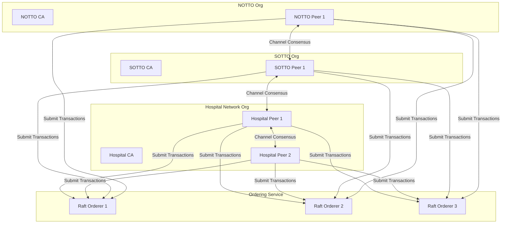
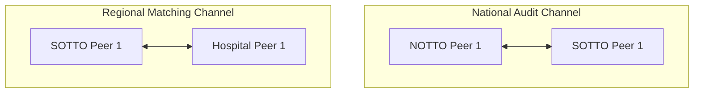
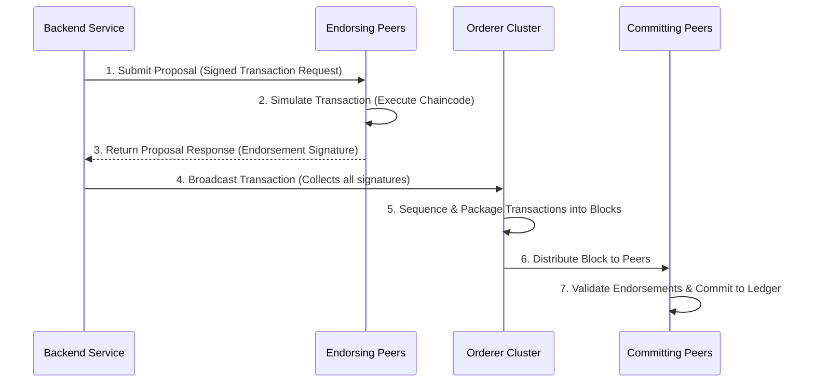

# Blockchain Architecture Document
## Blockchain-Enabled Human Organ Transplantation & Smart Organ Transport Platform

This document defines the Hyperledger Fabric architecture, network design, security controls, ledger structure, and transaction lifecycles for the transplantation and tracking system.

---

## 1. Blockchain Overview
In this platform, the blockchain is the single source of truth for all compliance-related events, matches, and state changes. It guarantees that transplantation guidelines (THOTA) are strictly followed, matching lists are not manually modified, and environmental and tampering logs during transport cannot be altered.

MongoDB handles raw, high-volume telemetry caching and patient identity metadata, while the blockchain secures cryptographic hashes, match signatures, and state transition histories.

---

## 2. Why Hyperledger Fabric
Hyperledger Fabric is selected as the blockchain platform for this system due to the following enterprise requirements:
*   **Privacy & Private Data Collections**: Patient records and donor matching lists are sensitive clinical data. Hyperledger Fabric allows storing private data collections (PDCs) off-chain or on specific authorized peer nodes while logging verification hashes to the shared ledger.
*   **Zero Gas Fees**: Unlike public blockchains (such as Ethereum or Polygon), transaction validation in Fabric does not require transaction fees. This makes it viable for high-frequency state updates like telemetry logs.
*   **Sub-Second Transaction Finality**: Organ transplantation requires immediate state transitions. Fabric uses a crash-fault-tolerant (CFT) Raft consensus mechanism to confirm blocks within milliseconds, removing the fork risks associated with public blockchains.
*   **Granular Access Controls**: Features built-in support for multiple Membership Service Providers (MSPs), aligning with regulatory hierarchies like NOTTO, ROTTO, SOTTO, and hospital networks.

---

## 3. Permissioned vs Public Blockchain
A comparison of blockchain models highlights why a permissioned framework is required for this application:

| Parameter | Public Blockchain (Ethereum/Polygon) | Permissioned Blockchain (Hyperledger Fabric) |
| :--- | :--- | :--- |
| **Identity Management** | Anonymous or pseudonymous. Anyone can join the network. | Known identities verified via Certificate Authorities (X.509 certificates). |
| **Transaction Cost** | Variable gas fees based on network congestion. | Zero transaction fees. |
| **Throughput & Latency**| Low throughput; block confirmations can take minutes. | High throughput (1000+ TPS) with immediate sub-second finality. |
| **Data Privacy** | All transactions are visible on the public ledger. | Native support for channels and Private Data Collections. |
| **Regulatory Alignment**| Difficult to align with healthcare privacy compliance (HIPAA/GDPR). | Easily aligned via access restrictions and private data stores. |

---

## 4. Network Topology
The system topology separates administrative, ordering, and validating nodes to ensure secure operations:



---

## 5. Organizations
The network consists of five primary organizations, each maintaining its own Membership Service Providers (MSPs) and cryptographic infrastructure:

1.  **NOTTO Organization (National Registry)**: The root administrative organization. Controls national waitlist policies, system overrides, and audits.
2.  **ROTTO Organization (Regional Registries)**: Manages matching queues, coordinates regional organ allocations, and audits SOTTO allocations.
3.  **SOTTO Organization (State Registries)**: Manages state-level allocations, coordinates local matches, and approves organ harvesting records.
4.  **Hospital Network Organization**: Includes participating transplant centers. Peers host smart contracts to submit donor/recipient updates and record transplant transactions.
5.  **Regulatory Authority Organization**: A non-validating auditing organization. Runs read-only observer nodes to inspect matching results and transport event histories.

---

## 6. Certificate Authorities
Each organization runs its own **Fabric Certificate Authority (Fabric-CA)**.
*   **Role**: Fabric-CAs issue X.509 digital certificates to authenticate admins, peers, client applications, and users within their respective organizations.
*   **Isolation**: If a hospital CA is compromised, its certificate is revoked without affecting NOTTO, ROTTO, or SOTTO cryptographic keys.

---

## 7. Peers
Peers run in containerized environments and are configured for specific roles:
*   **Endorsing Peers**: Run smart contracts (chaincode) to validate transaction proposals and return signed endorsements to clients.
*   **Committing Peers**: Verify endorsements and commit blocks to the local ledger.
*   **Anchor Peers**: Facilitate communication and identity discovery across organizations on a channel.

---

## 8. Ordering Service
*   **Architecture**: A multi-node Raft ordering service.
*   **Role**: Groups endorsed transactions into blocks, sequences them in chronological order, and distributes blocks to committing peers.
*   **Fault Tolerance**: A 3-node Raft cluster allows the network to continue processing transactions even if one ordering node fails.

---

## 9. Channels
The network is divided into dedicated channels to partition ledger data:



*   **`national-audit-channel`**: Connects NOTTO, ROTTO, and SOTTO nodes to audit matching histories and track national transplantation records.
*   **`regional-matching-channel`**: Connects state SOTTO nodes to regional hospital nodes to process donor/recipient listings and manage active transport sessions.

---

## 10. Private Data Collections (PDCs)
Private Data Collections (PDCs) protect patient privacy by keeping sensitive data off the main channel ledger:
*   **Mechanism**: Private data is sent peer-to-peer and stored in a private database (SideDB) on authorized hospital and audit nodes.
*   **Public Verification**: A cryptographic hash of the private data is written to the channel ledger, allowing auditors to verify the data's authenticity without exposing patient names or clinical profiles.

---

## 11. Membership Service Provider (MSP)
*   **Role**: The Membership Service Provider (MSP) translates X.509 certificates into roles and network permissions.
*   **Validation**: It defines which certificate signers are recognized as valid peers, orderers, or client users for an organization, establishing trust boundaries across the network.

---

## 12. Identity Management
*   **User Enrollment**: Hospital coordinators, doctors, and couriers are registered with their respective organization's Fabric-CA.
*   **Client Verification**: When an application makes an API request, the Blockchain Service signs the request with the user's private key, validating their identity to the endorsing peers.

---

## 13. Certificate Lifecycle
*   **Issuance**: Certificates are generated by Fabric-CA during user enrollment.
*   **Expiration**: Access keys are set to expire after 1 year to minimize risks from lost credentials.
*   **Revocation**: If an account is compromised, its certificate is added to the CRL (Certificate Revocation List), blocking its ability to execute transactions.

---

## 14. Endorsement Policies
Endorsement policies define the signatures required to commit a transaction to the ledger:
*   **Administrative State Changes (e.g., Adding a Hospital)**: Requires signatures from the NOTTO Coordinator AND SOTTO Coordinator:
    `OutOf(2, 'NOTTOMSP.member', 'SOTTOMSP.member')`
*   **Clinical Allocations (e.g., Finalizing a Match Queue)**: Requires signatures from the SOTTO Coordinator AND the Harvesting Hospital Coordinator:
    `And('SOTTOMSP.member', 'HospitalNetworkMSP.member')`
*   **Transport Transactions (e.g., Logging Telemetry Alert Events)**: Requires a signature from any peer belonging to the Hospital Network:
    `OR('HospitalNetworkMSP.member')`

---

## 15. Consensus Mechanism (Raft)
*   **Type**: Crash Fault Tolerant (CFT) Consensus.
*   **Leader Election**: Ordering nodes elect a leader node. The leader processes transactions, packages them into blocks, and replicates them across follower nodes.
*   **Rationale**: Raft prevents forks, processes transactions in sub-seconds, and does not require energy-intensive Proof-of-Work systems.

---

## 16. Ledger Structure
The Hyperledger Fabric ledger consists of two parts:

```
                  ┌──────────────────────────────┐
                  │    Hyperledger Fabric Ledger │
                  └──────────────┬───────────────┘
                                 │
                 ┌───────────────┴───────────────┐
                 │                               │
        ┌────────▼────────┐             ┌────────▼────────┐
        │   World State   │             │ Blockchain Log  │
        │   (CouchDB)     │             │ (Append-Only)   │
        └─────────────────┘             └─────────────────┘
```

*   **World State**: Stores the current value of assets (e.g., Organ ID status is "In Transit").
*   **Blockchain Log**: An append-only log of transaction blocks that records the history of state changes.

---

## 17. World State (CouchDB)
*   **Selection**: CouchDB is used as the state database instead of LevelDB.
*   **Rationale**: CouchDB supports rich JSON queries, allowing the backend to search and filter assets based on attributes like blood type, organ type, and status values directly.

---

## 18. Blockchain Data Model
Ledger entries are stored as key-value JSON records in CouchDB:

### 1. Match Record Schema
```json
{
  "assetType": "MatchRecord",
  "matchId": "MATCH-8890A-2026",
  "organHash": "a67f08d34b...",
  "recipientHash": "b2c15d90ee...",
  "priorityQueue": ["RECIP-HASH-1", "RECIP-HASH-2"],
  "algorithmName": "NOTTO-MATCH-1.2",
  "verificationDigest": "5a4f783cb2b110a12b3...",
  "sottoSignatures": ["SOTTO-SIG-HEX-1"],
  "nottoApproval": true,
  "timestamp": "2026-07-20T19:15:00Z"
}
```

### 2. Transport Audit Record Schema
```json
{
  "assetType": "TransportAudit",
  "missionId": "MISSION-10928B",
  "boxUuid": "ESP32-BOX-7789A",
  "dispatchTimestamp": "2026-07-20T19:45:00Z",
  "courierMspId": "HospitalNetworkMSP",
  "blockchainTransitState": "Dispatched",
  "receiptHandshakeHash": "",
  "breachesLogged": []
}
```

---

## 19. Smart Contract Responsibilities (High-Level)
*   **Enforcing Match Rules**: Validates that matching results align with tissue criteria and waitlist priority lists.
*   **Locking Transport States**: Ensures that transport states only advance sequentially (e.g., an organ cannot be marked "Delivered" unless it was previously marked "In Transit").
*   **Logging Security Events**: Validates and records alerts like temperature spikes and box tampering on the ledger.

---

## 20. Transaction Lifecycle
The transaction pipeline ensures all modifications to the ledger state are verified:



---

## 21. Access Control
Access to ledger functions is restricted at the chaincode layer:
*   Only client certificates belonging to the `NOTTOMSP` or `SOTTOMSP` roles can execute matching adjustments.
*   Hospital roles (`HospitalNetworkMSP`) are restricted to registering organ harvests and submitting transport completions.

---

## 22. Audit Strategy
*   **Independent Auditing**: Regulatory agencies run read-only observer nodes to view transaction histories and trace allocation decisions.
*   **Ledger Verification**: The backend verifies MongoDB data against ledger hashes, flagging discrepancies if local data has been altered.

---

## 23. Security Model
*   **Transport Layer Security (TLS)**: All communication between peers, orderers, and clients uses TLS 1.3 encryption.
*   **Hardware Security Modules (HSM)**: Peer private keys are stored in hardware security modules to protect them from network compromises.
*   **Network Isolation**: Docker containers run on isolated networks, restricting ledger access to authenticated gateway API nodes.

---

## 24. Disaster Recovery
*   **Raft Fault Tolerance**: A 3-node ordering cluster continues operating if a node fails.
*   **Ledger Resynchronization**: If a peer node crashes, it retrieves missing blocks from active peers on startup to rebuild its state.
*   **State Database Rebuilds**: If a CouchDB instance is corrupted, the peer node can rebuild the state database by replaying transactions from the ledger log.

---

## 25. Scalability
*   **State History Pruning**: CouchDB states are updated in place to keep database sizes small.
*   **Channel Partitioning**: Local hospital transactions are isolated to regional channels to prevent network bottlenecks.
*   **Endpoint Load Balancing**: The API gateway routes transaction proposals across multiple endorsing peers to balance network load.

---

## 26. Future Expansion
*   **Cross-Border Channels**: Connecting regional networks together to facilitate international organ transplants when local matches are unavailable.
*   **Interoperability**: Implementing decentralized identifiers (DIDs) to verify doctor licenses and patient identities across external hospital networks.

---

## 27. Event Verification Requirements

| Event | On-chain vs Off-chain | Why it belongs on Blockchain |
| :--- | :--- | :--- |
| **Donor Registration Approval** | On-chain (Hash) | Verifies the medical record exists and has been approved by SOTTO before matching begins. |
| **Recipient Verification** | On-chain (Hash) | Confirms the recipient was verified on the waitlist prior to receiving an organ. |
| **Matching Result Finalization** | On-chain (Detailed) | Records the ranked priority queue, preventing manual alterations of match orders. |
| **Hospital Approval** | On-chain (Detailed) | Logs the receiving doctor's acceptance, establishing accountability. |
| **Transport Dispatch** | On-chain (Detailed) | Marks the start of transit and associates the tracking box with the organ ID. |
| **Temperature Breach** | On-chain (Detailed) | Records cold-chain violations on the ledger to log whether the organ was compromised. |
| **Unauthorized Box Opening** | On-chain (Detailed) | Logs box tampering events to establish liability for potential damage. |
| **Hospital Receipt** | On-chain (Detailed) | Logs the receiving hospital's unlock key and transaction receipt. |
| **Transplant Completion** | On-chain (Hash) | Closes the case file, recording surgery details on the ledger. |
| **Audit Verification** | On-chain (Detailed) | Logs audit check results to confirm regulatory compliance. |
