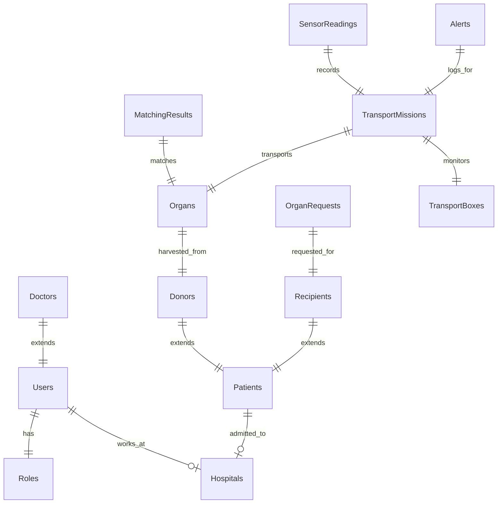

# Database Design Document
## Blockchain-Enabled Human Organ Transplantation & Smart Organ Transport Platform

This document describes the schema design, physical storage architecture, data indexing strategy, security rules, and data lifecycle management for the MongoDB off-chain database.

---

## 1. Database Overview
In this platform, MongoDB serves as the operational high-performance database, storing rich relational metadata, user state records, real-time sensor streams, and notification logs. All critical state changes and verification hashes are stored in the Hyperledger Fabric blockchain network, maintaining a clear boundary between operational caching (off-chain) and immutable audit records (on-chain).

---

## 2. Database Design Philosophy
Our database structure adheres to the following principles:
1.  **Compliance-Driven Partitioning**: Structuring clinical records (Donors, Recipients, Patients) to enforce access validation logic that aligns with national transplantation laws (e.g., India's THOTA regulations).
2.  **No PII on Ledger**: Personal Identifiable Information (PII) like names, license numbers, and contact details are stored in MongoDB. Only anonymized cryptographic hashes are written to the blockchain.
3.  **Hybrid Modeling (Reference vs. Embedded)**: Embedding is used for values that stay constant (e.g., user role permissions), while referencing is used for active business workflows (e.g., linking Donors to Harvested Organs) to prevent document size inflation.
4.  **High Write-Throughput Optimization**: Designing sensor storage configurations to support high-frequency telemetry logging from ESP32 tracking boxes without impacting core operational database reads.

---

## 3. Why MongoDB
MongoDB was selected as the off-chain datastore for the following reasons:
*   **Flexible Document Model**: Organ profiles (HLA matching sequences, preservation methods) differ across organ types. MongoDB's schema-flexibility accommodates these structural variations without complex join queries.
*   **Horizontal Scalability**: Sharding capabilities allow scale-out operations as additional hospital nodes join the network.
*   **Geospatial Queries**: Built-in 2dsphere indexes enable proximity calculations to find the closest recipient or track active transport couriers in real-time.

---

## 4. Collections Design

---

### Collection 1: Users
*   **Why it exists**: Manages accounts, credentials, and state information for system users.
*   **Who creates it**: Admin.
*   **Who updates it**: Admin, the user (for profile updates).
*   **Who reads it**: Auth Middleware, Admin, Hospital Coordinators.
*   **When it is archived**: Never. Deactivated users have `status` set to `inactive`.
*   **On-chain vs Off-chain**: Off-chain. Includes PII (name, email, phone).
*   **Relationships**: References `Roles` (ObjectId) and `Hospitals` (ObjectId).
*   **Indexes**: Unique index on `email`, index on `roleId`.
*   **Validation Rules**: `email` must match regex pattern; `passwordHash` must be a valid bcrypt string.
*   **Example Document**:
    ```json
    {
      "_id": "60c72b2f9b1d8b2bad18a201",
      "email": "dr.sharma@aims.edu",
      "passwordHash": "$2b$12$e0Z/Jk.xY5xM8...",
      "fullName": "Dr. Rajesh Sharma",
      "licenseNumber": "MCI-2023-98745",
      "roleId": "60c72b2f9b1d8b2bad18a100",
      "hospitalId": "60c72b2f9b1d8b2bad18a300",
      "status": "active",
      "createdAt": "2026-07-20T12:00:00Z",
      "updatedAt": "2026-07-20T12:00:00Z"
    }
    ```

---

### Collection 2: Roles
*   **Why it exists**: Stores access control mappings.
*   **Who creates it**: Admin.
*   **Who updates it**: Admin.
*   **Who reads it**: Auth Middleware, Admin.
*   **When it is archived**: Never.
*   **On-chain vs Off-chain**: Off-chain (embedded permissions definitions).
*   **Relationships**: Referenced by `Users`.
*   **Indexes**: Unique index on `name`.
*   **Validation Rules**: `name` must be one of: `Admin`, `NOTTO_Coordinator`, `Hospital_Coordinator`, `Doctor`, `Transport_Team`.
*   **Example Document**:
    ```json
    {
      "_id": "60c72b2f9b1d8b2bad18a100",
      "name": "Doctor",
      "permissions": ["READ_PATIENTS", "UPDATE_ORGAN_STATUS", "DECLINE_MATCH"],
      "createdAt": "2026-07-20T12:00:00Z"
    }
    ```

---

### Collection 3: Hospitals
*   **Why it exists**: Represents hospital profiles participating in the allocation network.
*   **Who creates it**: Admin.
*   **Who updates it**: Admin, Hospital Coordinators.
*   **Who reads it**: Users, Matching Engine, Public Directory.
*   **When it is archived**: Never.
*   **On-chain vs Off-chain**: Off-chain. Location coordinates are stored for proximity calculations.
*   **Relationships**: None.
*   **Indexes**: 2dsphere index on `location.coordinates`, index on `tier`.
*   **Validation Rules**: Coordinates must contain valid longitude and latitude.
*   **Example Document**:
    ```json
    {
      "_id": "60c72b2f9b1d8b2bad18a300",
      "name": "All India Institute of Medical Sciences (AIIMS)",
      "code": "AIIMS-DEL",
      "address": "Ansari Nagar, New Delhi, Delhi 110029",
      "location": {
        "type": "Point",
        "coordinates": [77.2104, 28.5672]
      },
      "tier": "Tier-1",
      "contactPhone": "+91-11-26588500",
      "isActive": true,
      "createdAt": "2026-07-20T12:00:00Z"
    }
    ```

---

### Collection 4: Doctors
*   **Why it exists**: Stores administrative, department, and assignment details for medical doctors.
*   **Who creates it**: Admin, Hospital Coordinator.
*   **Who updates it**: Hospital Coordinator, Doctor.
*   **Who reads it**: Hospital Coordinators, Patients, Allocators.
*   **When it is archived**: Archived to `Doctors_Archive` on contract termination.
*   **On-chain vs Off-chain**: Off-chain details linked to User account.
*   **Relationships**: References `Users` (ObjectId) and `Hospitals` (ObjectId).
*   **Indexes**: Unique index on `userId`, index on `specialty`.
*   **Validation Rules**: `specialty` and `department` are required fields.
*   **Example Document**:
    ```json
    {
      "_id": "60c72b2f9b1d8b2bad18a400",
      "userId": "60c72b2f9b1d8b2bad18a201",
      "hospitalId": "60c72b2f9b1d8b2bad18a300",
      "specialty": "Cardiothoracic Surgery",
      "department": "Transplant Medicine",
      "onCallStatus": "available",
      "createdAt": "2026-07-20T12:00:00Z"
    }
    ```

---

### Collection 5: Patients
*   **Why it exists**: Master list of patients receiving treatment.
*   **Who creates it**: Doctor, Hospital Coordinator.
*   **Who updates it**: Doctor.
*   **Who reads it**: Doctor, Hospital Coordinator, Matching Engine.
*   **When it is archived**: Archived to `Patients_Archive` if deceased or discharged.
*   **On-chain vs Off-chain**: Off-chain clinical data. Medical records are encrypted at the field level.
*   **Relationships**: References `Hospitals` (ObjectId) and `Doctors` (ObjectId).
*   **Indexes**: Unique index on `nationalId`, index on `bloodType`.
*   **Validation Rules**: `bloodType` must match ABO/Rh pattern.
*   **Example Document**:
    ```json
    {
      "_id": "60c72b2f9b1d8b2bad18a500",
      "nationalId": "IND-PAT-9912093",
      "fullName": "Aarav Kumar",
      "dateOfBirth": "1985-05-12T00:00:00Z",
      "bloodType": "O+",
      "primaryContact": "+91-9876543210",
      "treatingDoctorId": "60c72b2f9b1d8b2bad18a400",
      "admittingHospitalId": "60c72b2f9b1d8b2bad18a300",
      "createdAt": "2026-07-20T12:00:00Z"
    }
    ```

---

### Collection 6: Donors
*   **Why it exists**: Holds details of confirmed organ donors (living or deceased).
*   **Who creates it**: Hospital Coordinator, Doctor.
*   **Who updates it**: Doctor.
*   **Who reads it**: Doctor, Matching Engine.
*   **When it is archived**: 10 years after organ harvest completion.
*   **On-chain vs Off-chain**: Off-chain details. Identity links are encrypted.
*   **Relationships**: References `Hospitals` (ObjectId), `Patients` (ObjectId, optional if registered post-mortem).
*   **Indexes**: Index on `donorType`, index on `hlaType`.
*   **Validation Rules**: `donorType` must be `Living` or `Brain_Dead`.
*   **Example Document**:
    ```json
    {
      "_id": "60c72b2f9b1d8b2bad18a600",
      "patientId": "60c72b2f9b1d8b2bad18a500",
      "donorType": "Brain_Dead",
      "causeOfDeath": "Intracranial Hemorrhage",
      "hlaType": "A2,A30,B7,B44,Cw5,Cw7,DR15,DR4",
      "hemodynamicStability": "stable",
      "consentingAuthority": "Spouse (Meera Kumar)",
      "createdAt": "2026-07-20T12:00:00Z"
    }
    ```

---

### Collection 7: Recipients
*   **Why it exists**: Tracks active patients placed on the transplant waiting list.
*   **Who creates it**: Hospital Coordinator.
*   **Who updates it**: Doctor, Allocation Engine.
*   **Who reads it**: Matching Engine, Doctors, NOTTO Coordinators.
*   **When it is archived**: Archived to `Recipients_Archive` post-transplant.
*   **On-chain vs Off-chain**: Off-chain patient profile; priority score updates are mirrored on-chain.
*   **Relationships**: References `Patients` (ObjectId), `Hospitals` (ObjectId).
*   **Indexes**: Index on `urgencyScore` (descending), compound index on `[bloodType, urgencyScore]`.
*   **Validation Rules**: `urgencyScore` must be a value between 0 and 100.
*   **Example Document**:
    ```json
    {
      "_id": "60c72b2f9b1d8b2bad18a700",
      "patientId": "60c72b2f9b1d8b2bad18a500",
      "urgencyScore": 85.5,
      "dateJoinedWaitlist": "2026-01-10T14:30:00Z",
      "waitlistStatus": "active",
      "hlaType": "A2,A24,B8,B35,Cw4,Cw7,DR1,DR15",
      "preferredHospitalId": "60c72b2f9b1d8b2bad18a300",
      "createdAt": "2026-01-10T14:30:00Z"
    }
    ```

---

### Collection 8: Organs
*   **Why it exists**: Inventory of harvested organs awaiting matching/transport.
*   **Who creates it**: Harvest Surgeon, Hospital Coordinator.
*   **Who updates it**: Doctor, Transport Coordinator.
*   **Who reads it**: Matching Engine, Surgical Teams.
*   **When it is archived**: Archived 1 year after transplantation.
*   **On-chain vs Off-chain**: Off-chain. The cryptographic hash of the organ properties is stored on-chain.
*   **Relationships**: References `Donors` (ObjectId) and `Hospitals` (ObjectId).
*   **Indexes**: Index on `organType`, index on `status`.
*   **Validation Rules**: `coldIschemicLimitHrs` must be a positive integer.
*   **Example Document**:
    ```json
    {
      "_id": "60c72b2f9b1d8b2bad18a800",
      "donorId": "60c72b2f9b1d8b2bad18a600",
      "organType": "Heart",
      "harvestHospitalId": "60c72b2f9b1d8b2bad18a300",
      "harvestTimestamp": "2026-07-20T18:30:00Z",
      "status": "Harvested",
      "coldIschemicLimitHrs": 4,
      "preservationSolution": "Celsior",
      "blockchainRecordHash": "a67f08d...4f2a90",
      "createdAt": "2026-07-20T18:30:00Z"
    }
    ```

---

### Collection 9: Organ Requests
*   **Why it exists**: Formal request submitted by hospital when a recipient needs an organ.
*   **Who creates it**: Hospital Coordinator.
*   **Who updates it**: Hospital Coordinator, System Allocator.
*   **Who reads it**: Matching Engine, NOTTO Coordinators.
*   **When it is archived**: Archived 5 years after closure.
*   **On-chain vs Off-chain**: Off-chain request files; matches are verified on-chain.
*   **Relationships**: References `Recipients` (ObjectId) and `Hospitals` (ObjectId).
*   **Indexes**: Index on `status`, index on `organNeeded`.
*   **Validation Rules**: `status` must be `Pending`, `Matched`, `Fulfilled`, or `Cancelled`.
*   **Example Document**:
    ```json
    {
      "_id": "60c72b2f9b1d8b2bad18a900",
      "recipientId": "60c72b2f9b1d8b2bad18a700",
      "organNeeded": "Heart",
      "requestingHospitalId": "60c72b2f9b1d8b2bad18a300",
      "urgencyLevel": "Critical",
      "status": "Pending",
      "createdAt": "2026-07-20T19:00:00Z"
    }
    ```

---

### Collection 10: Matching Results
*   **Why it exists**: Holds candidates identified by the matching algorithm.
*   **Who creates it**: Allocation Engine (Server).
*   **Who updates it**: Doctor (accepts/rejects candidate).
*   **Who reads it**: Transplant Coordinators, Doctors.
*   **When it is archived**: Archived after recipient selection and transport launch.
*   **On-chain vs Off-chain**: Off-chain details. The matching outcome is stored on-chain.
*   **Relationships**: References `Organs` (ObjectId), `Organ Requests` (ObjectId), and `Recipients` (ObjectId).
*   **Indexes**: Compound index on `[organId, rank]`.
*   **Validation Rules**: Every record must include a compatibility score value.
*   **Example Document**:
    ```json
    {
      "_id": "60c72b2f9b1d8b2bad18aa00",
      "organId": "60c72b2f9b1d8b2bad18a800",
      "requestId": "60c72b2f9b1d8b2bad18a900",
      "candidates": [
        {
          "recipientId": "60c72b2f9b1d8b2bad18a700",
          "compatibilityScore": 96.4,
          "rank": 1,
          "decision": "Accepted"
        }
      ],
      "algorithmVersion": "NOTTO-MATCH-1.2",
      "runTimestamp": "2026-07-20T19:15:00Z"
    }
    ```

---

### Collection 11: Transport Missions
*   **Why it exists**: Manages active transport details and metrics.
*   **Who creates it**: Dispatch Coordinator.
*   **Who updates it**: Transport Crew, IoT Gateway, Receiving Hospital.
*   **Who reads it**: Admin, Hospital staff, Transport Crew.
*   **When it is archived**: Archived to `Transport_Archive` 3 years post-mission.
*   **On-chain vs Off-chain**: Off-chain metadata. Key handshakes and hash digests are written on-chain.
*   **Relationships**: References `Organs` (ObjectId), `Hospitals` (ObjectId, source/destination), `Transport Boxes` (ObjectId).
*   **Indexes**: Index on `status`, index on `boxId`.
*   **Validation Rules**: Destination hospital coordinates must be valid.
*   **Example Document**:
    ```json
    {
      "_id": "60c72b2f9b1d8b2bad18ab00",
      "organId": "60c72b2f9b1d8b2bad18a800",
      "boxId": "60c72b2f9b1d8b2bad18ac00",
      "originHospitalId": "60c72b2f9b1d8b2bad18a300",
      "destinationHospitalId": "60c72b2f9b1d8b2bad18a301",
      "courierName": "Express Life Logistics",
      "status": "In_Transit",
      "departureTime": "2026-07-20T19:45:00Z",
      "estimatedArrival": "2026-07-20T21:45:00Z",
      "createdAt": "2026-07-20T19:30:00Z"
    }
    ```

---

### Collection 12: Transport Boxes
*   **Why it exists**: Represents the physical IoT monitoring boxes.
*   **Who creates it**: Admin.
*   **Who updates it**: IoT Gateway, Admin.
*   **Who reads it**: Dispatch Coordinators, System Logs.
*   **When it is archived**: Never. Kept active or set to `Maintenance` status.
*   **On-chain vs Off-chain**: Off-chain asset registers.
*   **Relationships**: None.
*   **Indexes**: Unique index on `deviceUuid`.
*   **Validation Rules**: `hardwareVersion` must follow semver format.
*   **Example Document**:
    ```json
    {
      "_id": "60c72b2f9b1d8b2bad18ac00",
      "deviceUuid": "ESP32-BOX-7789A",
      "status": "Active",
      "hardwareVersion": "v2.1.0",
      "batteryHealth": 98.2,
      "lastCalibrationDate": "2026-06-01T00:00:00Z",
      "authorizedRfidUids": ["E4-B2-A8-10", "D9-5A-7C-F2"],
      "createdAt": "2026-06-01T00:00:00Z"
    }
    ```

---

### Collection 13: Sensor Readings
*   **Why it exists**: Raw time-series database containing sensor log events.
*   **Who creates it**: ESP32 Box via IoT Endpoint.
*   **Who updates it**: Never updated (write-once).
*   **Who reads it**: Live Dashboard (WebSockets), Reports Engine.
*   **When it is archived**: Transferred to cold storage 60 days after transport completion.
*   **On-chain vs Off-chain**: Off-chain details. If an out-of-bounds telemetry event occurs, it is flagged on-chain.
*   **Relationships**: References `Transport Missions` (ObjectId).
*   **Indexes**: Compound index on `[missionId, timestamp]`.
*   **Validation Rules**: Must contain valid temperature and location coordinates.
*   **Example Document**:
    ```json
    {
      "_id": "60c72b2f9b1d8b2bad18ad00",
      "missionId": "60c72b2f9b1d8b2bad18ab00",
      "timestamp": "2026-07-20T20:00:00Z",
      "temperature": 3.8,
      "location": {
        "type": "Point",
        "coordinates": [77.2215, 28.5721]
      },
      "tamperStatus": false,
      "batteryLevel": 88.5,
      "rssi": -65
    }
    ```

---

### Collection 14: Alerts
*   **Why it exists**: Records critical security or environmental violations during transit.
*   **Who creates it**: Backend Telemetry Service.
*   **Who updates it**: Hospital Coordinator, Admin (acknowledges alerts).
*   **Who reads it**: Live Dashboard, NOTTO Coordinators.
*   **When it is archived**: Saved for 3 years post-mission.
*   **On-chain vs Off-chain**: Alert metadata is off-chain. The alert index reference is written on-chain to prevent deletion.
*   **Relationships**: References `Transport Missions` (ObjectId) and `Sensor Readings` (ObjectId).
*   **Indexes**: Index on `resolved`, index on `severity`.
*   **Validation Rules**: `alertType` must be `Temperature_Breach`, `Tamper_Triggered`, `Path_Deviation`, or `Battery_Low`.
*   **Example Document**:
    ```json
    {
      "_id": "60c72b2f9b1d8b2bad18ae00",
      "missionId": "60c72b2f9b1d8b2bad18ab00",
      "readingId": "60c72b2f9b1d8b2bad18ad00",
      "alertType": "Temperature_Breach",
      "severity": "Critical",
      "details": "Temperature spiked to 9.2C (Limit 4.0C)",
      "resolved": false,
      "resolvedBy": null,
      "createdAt": "2026-07-20T20:01:00Z"
    }
    ```

---

### Collection 15: Notifications
*   **Why it exists**: Stores messages for dashboard users.
*   **Who creates it**: Notification Broker Service.
*   **Who updates it**: User (marks as read).
*   **Who reads it**: Recipient User.
*   **When it is archived**: Automatically deleted after 30 days via TTL index.
*   **On-chain vs Off-chain**: Off-chain operational notifications.
*   **Relationships**: References `Users` (ObjectId).
*   **Indexes**: Index on `[userId, isRead]`, TTL index on `createdAt`.
*   **Validation Rules**: `message` must not be empty.
*   **Example Document**:
    ```json
    {
      "_id": "60c72b2f9b1d8b2bad18af00",
      "userId": "60c72b2f9b1d8b2bad18a201",
      "title": "Organ Matched",
      "message": "A heart match has been confirmed for Recipient IND-PAT-9912093",
      "isRead": false,
      "createdAt": "2026-07-20T19:16:00Z"
    }
    ```

---

### Collection 16: Audit References
*   **Why it exists**: Links MongoDB documents to their corresponding blockchain transaction hashes.
*   **Who creates it**: Blockchain Service on transaction confirmation.
*   **Who updates it**: Never updated (write-once).
*   **Who reads it**: Audit Dashboard, Inspectors.
*   **When it is archived**: Never. Must be retained for matching validation.
*   **On-chain vs Off-chain**: Links off-chain to on-chain.
*   **Relationships**: None. Uses generic keys to link to any collection ID.
*   **Indexes**: Unique index on `transactionHash`, index on `targetRecordId`.
*   **Validation Rules**: `transactionHash` must match standard sha256 hex string.
*   **Example Document**:
    ```json
    {
      "_id": "60c72b2f9b1d8b2bad18b000",
      "targetCollection": "MatchingResults",
      "targetRecordId": "60c72b2f9b1d8b2bad18aa00",
      "blockchainChannel": "organchannel",
      "transactionHash": "5a4f783cb2b110a12b367cd20a1bcde493f0b2da1128c74fbcd73821092abf48",
      "blockNumber": 482,
      "createdAt": "2026-07-20T19:16:05Z"
    }
    ```

---

### Collection 17: Reports
*   **Why it exists**: Saves generated reports (e.g. system usage, audit logs).
*   **Who creates it**: Reporting Service.
*   **Who updates it**: Never updated (write-once).
*   **Who reads it**: NOTTO Coordinators, Hospital Admins.
*   **When it is archived**: Moved to archival databases after 3 years.
*   **On-chain vs Off-chain**: Off-chain report records.
*   **Relationships**: References `Users` (ObjectId, creator).
*   **Indexes**: Index on `generatedAt`.
*   **Validation Rules**: `reportType` must be `Audit_Digest` or `Performance_Metrics`.
*   **Example Document**:
    ```json
    {
      "_id": "60c72b2f9b1d8b2bad18b100",
      "reportType": "Audit_Digest",
      "generatedBy": "60c72b2f9b1d8b2bad18a201",
      "dateRange": {
        "start": "2026-07-01T00:00:00Z",
        "end": "2026-07-20T00:00:00Z"
      },
      "s3DownloadUrl": "https://s3.ap-south-1.amazonaws.com/reports/audit-52a3b1.pdf",
      "digestHash": "b8f9e0...",
      "generatedAt": "2026-07-20T21:00:00Z"
    }
    ```

---

### Collection 18: System Logs
*   **Why it exists**: Tracks application issues, security events, and debugging trace logs.
*   **Who creates it**: Winston Logging Service.
*   **Who updates it**: Never updated.
*   **Who reads it**: System Administrators, Developers.
*   **When it is archived**: Automatically deleted after 14 days using MongoDB TTL.
*   **On-chain vs Off-chain**: Off-chain debug information.
*   **Relationships**: None.
*   **Indexes**: TTL index on `timestamp`.
*   **Validation Rules**: `level` must be `info`, `warn`, or `error`.
*   **Example Document**:
    ```json
    {
      "_id": "60c72b2f9b1d8b2bad18b200",
      "level": "error",
      "service": "BlockchainService",
      "message": "Connection to peer0.org1.com lost temporarily",
      "stackTrace": "Error: gRPC Connection Timeout...",
      "timestamp": "2026-07-20T21:05:00Z"
    }
    ```

---

## 5. Storage Classifications
To optimize system operations, data is divided into distinct storage classifications:

```
┌────────────────────────────────────────────────────────────────────────┐
│                          DATA CLASSIFICATIONS                          │
├────────────────────────────────────────────────────────────────────────┤
│  Off-Chain Data (MongoDB)                                               │
│  - Names, license numbers, phone numbers, contact records               │
│  - System log entries, notification streams                            │
├────────────────────────────────────────────────────────────────────────┤
│  On-Chain Data (Hyperledger Fabric)                                    │
│  - Hash signatures of organ files                                      │
│  - Transaction IDs, allocation order, dispatch logs                    │
├────────────────────────────────────────────────────────────────────────┤
│  Cached Data (In-Memory / Redis / MongoDB)                             │
│  - Blockchain transaction indexes, hospital statuses                   │
├────────────────────────────────────────────────────────────────────────┤
│  Derived Data (Calculated on request)                                  │
│  - Average transit times, temperature deviation charts                 │
└────────────────────────────────────────────────────────────────────────┘
```

1.  **Off-Chain Data (MongoDB Only)**: Includes user data, doctor credentials, patients, and raw sensor coordinate lists. These fields are not critical for blockchain state matching and are stored in MongoDB to improve performance.
2.  **On-Chain Data (Hyperledger Fabric Only)**: Consists of organ dispatch approvals, matching queue decisions, and tamper alarms. These entries are logged to the ledger to prevent unauthorized modification.
3.  **Cached Data (In-Memory / MongoDB)**: Serves as a read-cache of ledger status keys (e.g., listing an organ status as "Harvested" rather than querying HLF nodes directly for every request).
4.  **Derived Data**: Calculated on request. Examples include remaining battery estimates and cold ischemic time alerts.

---

## 6. References & Relationships Design
Relationships are managed using MongoDB object references to keep the database design clean:



*   **1:1 Extensions**: Implemented via shared key values. For example, the `Doctors`, `Donors`, and `Recipients` documents reference their base profiles in the `Users` and `Patients` collections using `userId` and `patientId` links.
*   **1:Many Links**: Managed via parent object references rather than embedding. For instance, `SensorReadings` documents store a reference `missionId` to link them to their parent transport mission, avoiding issues with document size limits.

---

## 7. Search Strategy
1.  **Geospatial Queries**: Active transport trackers search the `Hospitals` coordinates collection using `$near` and `$geoWithin` operators to find optimal drop-off points.
2.  **Waitlist Queries**: Matching searches query the `Recipients` collection sorted by `bloodType` and `urgencyScore` (descending), using indexes to ensure fast responses.
3.  **Audit Trail Queries**: Audit pages retrieve data from the `AuditReferences` collection using `targetRecordId` to verify MongoDB records against their blockchain transaction details.

---

## 8. Scalability Strategy
*   **Database Sharding**: The database shards collections using the following keys:
    *   `SensorReadings` is sharded by `{ missionId: 1, timestamp: 1 }` to distribute live tracking writes across active shards.
    *   `AuditReferences` is sharded by `targetRecordId` to speed up verification lookups.
*   **Read Replicas**: The application uses replica sets (1 Primary, 2 Secondaries) to route read queries away from the primary write database.

---

## 9. Data Lifecycle & Retention Policy
*   **Sensor Readings**: Stored in MongoDB for 60 days. After 60 days, they are archived to cold-storage files and removed from the active database.
*   **Notifications**: Automatically purged 30 days after creation using a TTL index.
*   **System Logs**: Purged after 14 days to conserve disk space.
*   **Matching and Medical Records**: Retained in active database tables for 10 years to comply with healthcare regulatory rules.

---

## 10. Backup Strategy
*   **Regular Snapshots**: Automated snapshots are taken every 4 hours and stored in offsite object storage.
*   **Point-in-Time Recovery (PITR)**: MongoDB Oplog tailing is enabled to allow database restores to any specific second in the event of database failures.
*   **Disaster Recovery**: Replicas are distributed across multiple availability zones to ensure continuous service availability.

---

## 11. Database Architecture Decisions

### 1. Hybrid Storage Strategy
*   **Decision**: Store detailed sensor telemetry in MongoDB and register transaction hashes on Hyperledger Fabric.
*   **Rationale**: Registering every sensor update on the blockchain is cost-prohibitive. Using MongoDB for telemetry storage while registering transaction verification hashes on the ledger ensures high performance and data auditability.

### 2. Embedded Roles permissions vs Reference Collections
*   **Decision**: Embedding permissions directly inside `Roles` documents while referencing `Roles` inside `Users` documents.
*   **Rationale**: System permissions are rarely updated and small in size. Embedding them in roles documents avoids complex queries during user authentication checks.

---

## 12. Future Expansion Strategy
*   **Time-Series Collections**: Migrating telemetry databases to MongoDB Time-Series collections as the number of IoT tracking boxes scale up to reduce storage usage.
*   **Multi-Region Sharding**: Implementing location-based sharding to store patient medical records in their respective state regions, ensuring compliance with local healthcare privacy regulations.
