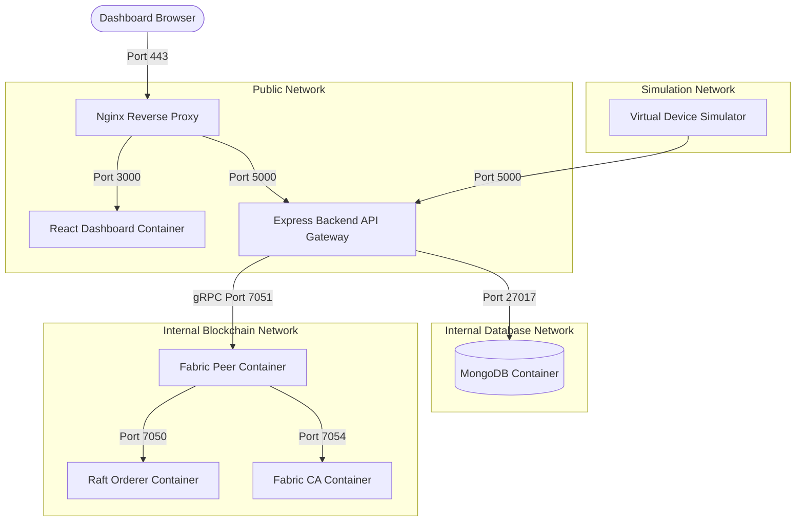

# Deployment Architecture Document
## Blockchain-Enabled Human Organ Transplantation & Smart Organ Transport Platform

This document describes the deployment topologies, environment matrices, container configurations, volume strategies, and operational infrastructure for the platform.

---

## 1. Deployment Goals
The deployment model is designed to support the following non-functional goals:
*   **Hardware Independence**: Switching the Virtual Device Simulator for a physical ESP32 box requires zero changes to the Express backend APIs or database schemas.
*   **Environment Parity**: Uses identical containerized environments across developer laptops, demo setups, and production servers to prevent environment-specific bugs.
*   **Scale Independence**: Allows the frontend dashboard, API gateway, databases, and blockchain peers to be scaled up or down independently based on processing load.
*   **Secure Boundaries**: Restricts database access to backend nodes via isolated virtual networks.

---

## 2. Deployment Profiles
The platform supports three distinct deployment profiles:

### 1. Development Profile (Developer Workspace)
Optimized for local coding, debugging, and API testing:
*   **Host**: Developer PC.
*   **Containers**: React Dashboard (Vite dev server), Express API Gateway, single MongoDB instance, and the Virtual Device Simulator.
*   **Blockchain**: A simplified Hyperledger Fabric test network (one peer node, one orderer node, one CA node).
*   **Testing Tool**: Bruno API Client for mock queries.

### 2. Demo / Hackathon Profile (Presentation Setup)
Optimized for zero-network environments, offline stability, and high performance:
*   **Host**: Presenter Laptop.
*   **Containers**: React Dashboard (production static build served via local Nginx), Express API Gateway, single MongoDB instance, and the Virtual Device Simulator running scenario routines (e.g. temperature breach, routes).
*   **Blockchain**: Hyperledger Fabric test network.
*   **Visual Display**: Full-screen live dashboard tracking simulated telemetry changes on a map.

### 3. Production Profile (Enterprise Cluster)
Optimized for high availability, security, and real-time operations:
*   **Host**: Hospital Network Cloud (AWS/Private Cloud).
*   **Topology**: High-availability Nginx load balancer routing traffic to an Express service cluster, a MongoDB replica set, and an enterprise Hyperledger Fabric network (multiple peer organizations, raft orderer nodes, and Certificate Authorities).
*   **Devices**: Real ESP32 boxes transmitting data over cellular fallback connections (MQTTS/HTTPS).

---

## 3. Environment Matrix

| Component | Development Profile | Demo / Hackathon Profile | Production Profile |
| :--- | :--- | :--- | :--- |
| **React Frontend** | Vite Dev Server | Nginx (Static Build) | Nginx Load Balancer + CDN |
| **Express Backend** | Single Instance (Node) | Single Instance (PM2) | PM2 Clustering (Autoscaling) |
| **MongoDB** | Single Container | Single Container | 3-Node Replica Set |
| **Hyperledger Fabric**| 1 Peer, 1 Orderer, 1 CA | 1 Peer, 1 Orderer, 1 CA | Multi-Org (Peers, Raft Orderers, CAs) |
| **Virtual Simulator** | Active (Interactive) | Active (Scenario Run) | Inactive (Testing/Backup Only) |
| **Physical ESP32** | Disabled | Optional (Display Only) | Active (Production Edge) |

---

## 4. Container Dependency Graph

The platform services are organized in Docker networks to isolate databases and ledger peers from public web traffic:

---

## 5. Network Segmentation & Ports
To prevent unauthorized database access, container communications are divided into isolated Docker networks:

*   **`frontend-net`**: Bridges Nginx, the React app, and the Express backend. Only Ports `80` (HTTP) and `443` (HTTPS) are exposed to public interfaces.
*   **`backend-net`**: Connects the Express backend to MongoDB. The database port (`27017`) is not exposed to the host machine.
*   **`blockchain-net`**: Connects the Blockchain Service to the Hyperledger Fabric nodes. Communication runs over TLS-encrypted gRPC channels on Port `7051`.

---

## 6. Volume Strategy & Data Persistence
Containers are configured as stateless units. Data persistence is managed using Docker volumes mapped to secure host directories:

*   **`mongo-data`**: Maps to `/var/lib/mongodb` within the database container, persisting system records and telemetry logs across restarts.
*   **`fabric-peer-certs`**: Maps to cryptographic certificate stores, ensuring peer identities remain valid when nodes reboot.
*   **`fabric-ledger-state`**: Maps peer data folders to host storage to protect the block ledger history.

---

## 7. Service Discovery & Health Checks
*   **Service Discovery**: Managed by Docker's built-in DNS service. The Express backend resolves database connections using `mongodb://mongodb-service:27017` rather than static IP addresses.
*   **Health Checks**: Core containers run periodic health checks to auto-restart failed nodes:
    *   *Express Backend*: `curl -f http://localhost:5000/health || exit 1`
    *   *MongoDB*: `mongosh --eval 'db.runCommand("ping").ok' --quiet || exit 1`
    *   *Virtual Simulator*: `node scripts/ping-gateway.js || exit 1`

---

## 8. Logging, Monitoring & Backup Strategy
*   **Logging**: Container logs are captured by the Docker daemon and forwarded to log rotators to prevent storage bloat. Active errors generate Winston logs stored in MongoDB.
*   **Secrets Management**: Environment variables (JWT secrets, database credentials, peer private keys) are loaded from a git-ignored `.env` file in development, and injected via Docker secrets or secure vault services in production.
*   **Backup Policy**: The MongoDB replica set runs daily automated backups. Ledger peers rely on Raft replication across hospital hosts to prevent data loss.

---

## 9. Future Kubernetes Migration Considerations
As the platform expands to cover additional regional hospitals:
*   **Pod Structuring**: Frontend assets, Express APIs, and IoT gateway services will be grouped into distinct Kubernetes Pods.
*   **Ingress Routing**: Kubernetes Ingress controllers will replace static Nginx files to manage load balancing and route incoming traffic based on request types.
*   **StatefulSets**: MongoDB replica sets and Hyperledger Fabric peers will deploy as StatefulSets to manage persistent storage claims consistently.
