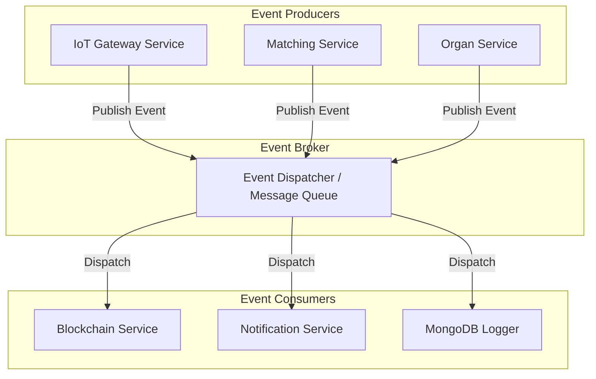

# Event-Driven Architecture Document
## Blockchain-Enabled Human Organ Transplantation & Smart Organ Transport Platform

This document describes the event models, producers, consumers, payloads, and reliability mechanisms that govern asynchronous operations across the platform.

---

## 1. Event-Driven Architecture Overview
The platform processes transactions and telemetry updates using an event-driven architecture. This decouples time-sensitive operations (such as sensor tracking and matching engines) from slow operations (such as writing blocks to the Hyperledger Fabric blockchain or sending email notifications).

```
[ Event Producer ] ────> [ Event Broker ] ────> [ Event Consumer ]
 (e.g. IoT Gateway)                               (e.g. Blockchain Service)
```

By decoupling these services, the platform guarantees that system latency or temporary service drops do not cause data loss.

---

## 2. Event Routing Topology



---

## 3. Domain Events Catalog

The system defines the following core domain events to coordinate workflows:

### 1. `ORGAN_HARVESTED`
*   **Triggered When**: A surgeon completes the harvesting procedure and logs viability metrics.
*   **Producer**: Organ Service.
*   **Consumers**: Matching Service (triggers matching calculation), Notification Service (alerts SOTTO coordinates).

### 2. `MATCH_CALCULATED`
*   **Triggered When**: The matching algorithm finishes sorting waitlist candidates.
*   **Producer**: Matching Service.
*   **Consumers**: Blockchain Service (commits match queue hash), Notification Service (alerts hospital coordinators).

### 3. `MATCH_ACCEPTED`
*   **Triggered When**: The recipient surgeon accepts the matching organ.
*   **Producer**: Organ Service.
*   **Consumers**: Transport Service (creates transport mission ID), Blockchain Service (updates organ status).

### 4. `MISSION_DISPATCHED`
*   **Triggered When**: The courier locks the transport box with an authorized RFID badge.
*   **Producer**: Transport Service.
*   **Consumers**: IoT Gateway (updates box state to active), Notification Service (sends alerts to recipient surgical teams).

### 5. `TELEMETRY_RECORDED`
*   **Triggered When**: The tracking box uploads sensor logs.
*   **Producer**: IoT Gateway Service.
*   **Consumers**: Live Dashboard (WebSocket update), MongoDB Logger.

### 6. `COLD_CHAIN_VIOLATED`
*   **Triggered When**: Temperature exceeds threshold limits.
*   **Producer**: IoT Gateway Service.
*   **Consumers**: Notification Service (sends SMS/Email alerts to doctors), Blockchain Service (commits audit event).

### 7. `BOX_TAMPERED`
*   **Triggered When**: Lid switch detects physical open without authorization.
*   **Producer**: IoT Gateway Service.
*   **Consumers**: Notification Service (alerts security), Blockchain Service (logs tamper audit block).

### 8. `MISSION_COMPLETED`
*   **Triggered When**: Receiving surgeon unlocks the box at destination.
*   **Producer**: Transport Service.
*   **Consumers**: Blockchain Service (commits delivery proof), Notification Service (alerts staff).

---

## 4. Blockchain & IoT Event Triggers
Certain domain events automatically trigger secondary processes in the blockchain and IoT layers:

```
[ Domain Event ] ──> [ Event Router ]
                           │
             ┌─────────────┴─────────────┐
             ▼                           ▼
[ Blockchain Trigger ]             [ IoT Gateway Trigger ]
(Commit Block to HLF)              (Send Command to ESP32 Box)
```

### Blockchain-Triggering Events
*   `MATCH_CALCULATED`: Commits priority queue hashes to ensure compliance.
*   `COLD_CHAIN_VIOLATED`: Logs temperature breaches to maintain an unalterable audit trail.
*   `BOX_TAMPERED`: Logs security breaches to document potential handling liability.
*   `MISSION_COMPLETED`: Records final delivery signatures to close the case file.

### IoT-Triggering Events
*   `MISSION_DISPATCHED`: Signals the box to transition to active monitoring mode.
*   `COLD_CHAIN_VIOLATED`: Sends a command to activate the local buzzer and flash the red status LED.
*   `MISSION_COMPLETED`: Disarms the alarm logic and allows the lid to be opened.

---

## 5. Event Payload Specifications (JSON Schemas)

### Event Wrapper Schema
```json
{
  "eventId": "EVT-8890A-102",
  "eventType": "COLD_CHAIN_VIOLATED",
  "producer": "IoT-Gateway-Service",
  "timestamp": "2026-07-20T20:01:00Z",
  "data": {}
}
```

### Event Payload: `COLD_CHAIN_VIOLATED`
```json
{
  "missionId": "60c72b2f9b1d8b2bad18ab00",
  "deviceUuid": "ESP32-BOX-7789A",
  "currentTemperature": 9.2,
  "thresholdLimit": 4.0,
  "gpsCoordinates": [28.5721, 77.2215],
  "durationSecondsAboveLimit": 300
}
```

---

## 6. Notification Workflows
The Notification Service processes events to route messages based on role profiles:

```
[ Domain Event ] ──> [ Notification Service ] ──> [ Role Router ]
                                                        │
                      ┌─────────────────────────────────┼─────────────────────────────────┐
                      ▼                                 ▼                                 ▼
              [ Doctor Alert ]                 [ Coordinator Alert ]             [ Courier Alert ]
               (SMS / Email)                     (Dashboard Notification)          (SMS Alerts)
```

*   **Critical Alerts (Tamper, Temperature Breach)**: Dispatched immediately via SMS and in-app alerts to doctors and security teams.
*   **Status Updates (Dispatched, Arrived)**: Sent as in-app dashboard notifications to coordination coordinators.

---

## 7. Reliability & Error Handling
To prevent event loss, the system implements the following reliability controls:

*   **Retry Policy**: If a consumer fails to process an event (e.g. temporary database drop), the dispatcher retries delivery using an **Exponential Backoff** strategy (e.g., retrying after 1s, 2s, 4s, 8s, up to 5 attempts).
*   **Idempotency**: Every event contains a unique `eventId`. Consumers track processed IDs to discard duplicate events, preventing double-processing issues.
*   **Dead-Letter Queue (DLQ)**: If an event cannot be processed after 5 retries, it is moved to a Dead-Letter Queue (DLQ) for administrator review and manual troubleshooting.
