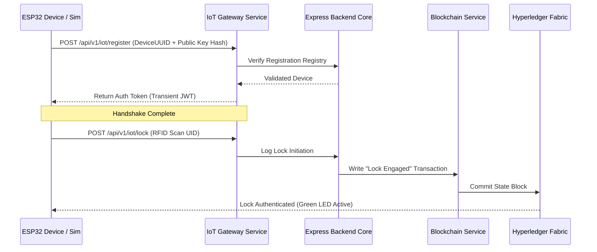

# Device Layer & IoT Edge Architecture Document
## ESP32 Smart Organ Transport Box & Digital Twin Simulator

This document specifies the hardware components, digital twin simulator, interface contracts, offline queuing mechanisms, power profiles, and communication protocols for the Device Layer.

---

## 1. Device Layer Overview & Design Pattern
To enable parallel development and ensure hardware independence, the system implements a **Simulator-First Digital Twin Architecture**. The platform does not couple backend API services directly to physical hardware. Instead, all device operations are defined by a stable **Device Interface Contract**.

```
                           Core Application Services
                          (API Gateway / IoT Service)
                                       │
                                       ▼
                            [ Device Interface ]
                                       │
                 ┌─────────────────────┴─────────────────────┐
                 │                                           │
                 ▼                                           ▼
      [ ESP32 Digital Twin ]                      [ ESP32 Hardware ]
        (Node.js Simulator)                       (C++ / FreeRTOS Edge)
```

Both the **ESP32 Simulator** and the **ESP32 Hardware** implement the identical payload format and communication contract, allowing the system to switch between simulated and physical devices without backend modifications.

---

## 2. Device Interface Contract
All devices operating in the transport layer must implement the following core interface interactions:

*   `authenticate()`: Resolves JWT credentials using cryptographic device identifiers.
*   `sendTelemetry()`: Transmits runtime metrics (temperature, coordinates, battery, and lock status) to the gateway.
*   `reportAlert()`: Dispatches high-priority event frames (lid breaches or temperature spikes).
*   `syncOfflineLogs()`: Uploads buffered telemetry records once connectivity is restored.
*   `heartbeat()`: Confirms device connection status during idle phases.

---

## 3. Hardware Component Specification (Physical Implementation)
When deployed on physical hardware, the device uses the following components:

*   **Microcontroller**: ESP32-WROOM-32D (Dual-core Tensilica LX6, 240MHz, 520KB SRAM, 4MB Flash). Dual-core operation separates sensor reading tasks from network synchronization processes.
*   **DS18B20 Temperature Sensor**: A digital thermometer operating over a 1-Wire bus to monitor the ice/preservation solution interface.
*   **NEO-6M GPS Module**: Coordinates with satellite networks via hardware UART interface to transmit location coordinates.
*   **RC522 RFID Reader**: Reads 13.56 MHz tags (such as transport crew badges) over an SPI interface to authenticate lock/unlock actions.
*   **Reed Switch (Tamper Sensor)**: A magnetic sensor placed on the box lid interface. A break in the magnetic connection triggers an interrupt-driven tamper alarm.
*   **Buzzer & RGB Status LEDs**: Provide local audio-visual feedback (e.g. solid green for normal operation, flashing red for alarms).
*   **Power Supply**: A 3.7V 18650 Li-ion rechargeable battery pack providing up to 24 hours of operation under active tracking.

---

## 4. ESP32 Digital Twin Simulator
The simulator is written in Node.js and replicates the behavior of the physical transport box. It supports the following operational modes:

### Simulation Folder Structure
```text
simulation/
│
├── simulator-server.js      # Main execution script to spin up simulated boxes
│
├── scenarios/               # Standardized state transitions for testing
│   ├── normal-transport.json
│   ├── temperature-breach.json
│   ├── tamper.json
│   ├── battery-low.json
│   ├── gps-route.json
│   └── network-loss.json
│
└── devices/
    └── transport-box.js     # Class containing simulated sensor state machines
```

### Simulated Scenario Configurations
1.  **Normal Transport**: Replicates regular transit. Temperature maintains a stable 4.0°C (±0.2°C), battery charge decreases slowly, and GPS coordinates update along a route with no tamper flags active.
2.  **Temperature Breach**: Simulates cooling insulation failure. The temperature rises above 6.0°C, triggering local warnings and dispatching warning flags to the gateway.
3.  **GPS Route Simulation**: Animates coordinate values along coordinates matching a path from Hospital A to Hospital B at consistent time intervals.
4.  **Tamper Event**: Simulates unauthorized physical access. The tamper switch state transitions from closed to open without prior RFID card authorization, triggering an immediate alarm payload.
5.  **RFID Verification**: Simulates badge authentication scans. Scanning an unauthorized card ID triggers a validation failure alert, while scanning an authorized card ID unlocks the actuator.
6.  **Network Loss & Queue Synchronization**: Replicates network drops during transit. The simulator turns off its internet connection, caches telemetry to an internal memory array, and synchronizes the buffered records upon reconnection.

---

## 5. Offline Ring Buffer (Eventual Consistency)
To protect data during network drops, both the physical device and the simulator implement an offline queue manager:

```
[ New Telemetry Log ] ──> [ Connection Available? ]
                                │
                        ┌───────┴───────┐
                     Yes│             No│
                        ▼               ▼
                 [ POST Gateway ]    [ Cache to Ring Buffer (FIFO) ]
                        ▲               │
                        │               ▼
                        └───────[ Reconnection Event ]
```

*   **Physical (Flash Memory)**: Stores logs in its onboard SPIFFS flash memory.
*   **Simulator (Memory Array)**: Caches records in an in-memory queue array.
*   **Sync Rules**: Telemetry is buffered in a FIFO ring queue (up to 2,000 entries). When connection is restored, logs are uploaded to `/api/v1/iot/telemetry/sync` in chunks of 50 to prevent gateway timeout errors.

---

## 6. Edge-to-Gateway Handshake & Verification



---

## 7. Power Profiles & Sleep Modes
To maximize battery life during long transit missions, the system implements power-saving states:

| Mode | Active Components | Current Draw (mA) | Expected Battery Life |
| :--- | :--- | :--- | :--- |
| **Active Monitoring** | CPU 240MHz, GPS active, WiFi/LTE transmit | 150 - 250 mA | ~12 - 16 hours |
| **Low-Power Transit** | CPU 80MHz, GPS (periodic 1m), LTE standby | 50 - 70 mA | ~24 - 36 hours |
| **Deep Sleep (Idle)** | RTC memory only, wake up on RFID / Tamper interrupt | < 1 mA | > 3 months |

---

## 8. Sensor Data Format Schema (JSON Payloads)

Both simulated and physical devices use the same JSON payload structures:

### 1. Standard Telemetry Log (Device to Gateway)
```json
{
  "deviceUuid": "ESP32-BOX-7789A",
  "timestamp": 1784634890,
  "payload": {
    "temperature": 3.8,
    "gps": {
      "latitude": 28.5672,
      "longitude": 77.2104,
      "speedKnots": 34.5,
      "satellites": 9
    },
    "batteryPercentage": 92.4,
    "tamperDetected": false,
    "rssi": -68
  }
}
```

### 2. Alert Event Log (Device to Gateway)
```json
{
  "deviceUuid": "ESP32-BOX-7789A",
  "timestamp": 1784635200,
  "alert": {
    "type": "TAMPER_LID_OPENED",
    "details": "Lid switch triggered without RFID authorization",
    "currentTemperature": 4.1,
    "coordinates": [28.5672, 77.2104]
  }
}
```

---

## 9. Future Enhancements
*   **Narrowband IoT (NB-IoT)**: Shifting to NB-IoT networks to provide cellular coverage in remote areas.
*   **Decentralized OTA Updates**: Implementing encrypted over-the-air (OTA) updates using hashes stored on the blockchain to verify firmware authenticity.
