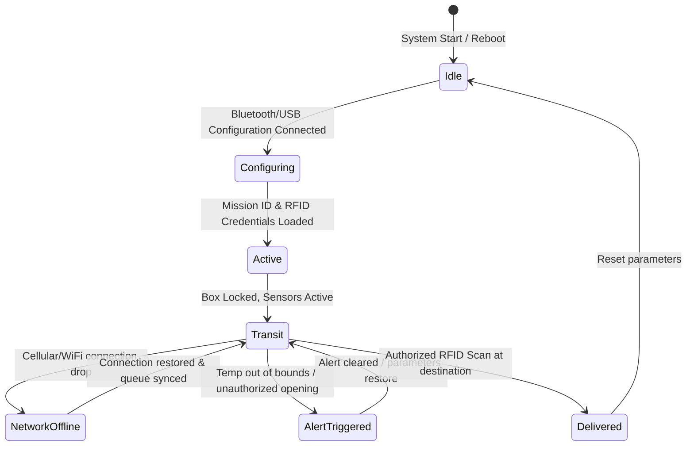
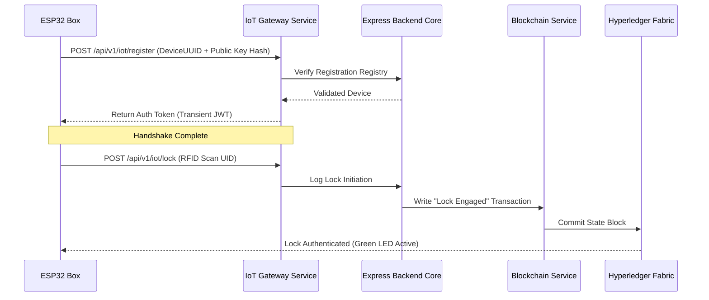

# IoT Edge Architecture Document
## ESP32 Smart Organ Transport Box

This document specifies the hardware components, firmware architecture, sensor interfaces, offline queuing mechanisms, power profiles, and communication protocols for the ESP32 Smart Organ Transport Box.

---

## 1. IoT System Overview
The smart transport box is a self-contained, battery-powered monitoring unit designed to protect the physical integrity and thermal stability of human organs in transit. 

Integrating real-time tracking, physical locking mechanisms, and continuous logging, the unit functions as an edge sentinel. It communicates with the backend IoT Gateway Service via encrypted protocols (HTTPS/MQTTS), logging environmental conditions (temperature, location, physical tampers) and syncing verification events directly to the Hyperledger Fabric ledger.

---

## 2. Hardware Component Specification

```
                ┌──────────────────────────────────────┐
                │      ESP32 Microcontroller (WROOM)   │
                └──────────────────┬───────────────────┘
                                   │
      ┌────────────────────────────┼────────────────────────────┐
      │ INPUT SENSORS              │ LOCAL OUTPUTS              │ CONNECTIVITY
      ├────────────────────────────┼────────────────────────────┼────────────────
      │ - Temp: DS18B20 (OneWire)  │ - Buzzer (PWM)             │ - WiFi 802.11
      │ - GPS: NEO-6M (UART)       │ - RGB Status LEDs (GPIO)   │ - LTE (SIM800L)
      │ - RFID: RC522 (SPI)        │ - Lock Actuator (GPIO)     │
      │ - Tamper: Reed Switch      │                            │
      │ - Battery: ADC voltage     │                            │
```

### Component Details
*   **Microcontroller**: ESP32-WROOM-32D (Dual-core Tensilica LX6, 240MHz, 520KB SRAM, 4MB Flash). Dual-core operation separates sensor reading tasks from network synchronization processes.
*   **DS18B20 Temperature Sensor**: A high-accuracy digital thermometer operating over a 1-Wire bus. Placed inside the cold chamber to monitor the ice/preservation solution interface.
*   **NEO-6M GPS Module**: Coordinates with satellite networks via hardware UART interface to transmit location data (latitude, longitude, velocity, satellites tracked).
*   **RC522 RFID Reader**: Reads 13.56 MHz tags (such as transport crew badges) over an SPI interface to authenticate lock/unlock actions.
*   **Reed Switch (Tamper Sensor)**: A magnetic sensor placed on the box lid interface. A break in the magnetic connection triggers an interrupt-driven tamper alarm.
*   **Buzzer**: A piezoelectric audio indicator driven by PWM signals to alert couriers of temperature breaches or unauthorized openings.
*   **RGB Status LEDs**: Displays system states:
    *   *Green (Solid)*: Normal operation (parameters within limits, connected).
    *   *Blue (Flashing)*: Awaiting dispatch configuration / Bluetooth sync.
    *   *Red (Solid/Flashing)*: Critical alert (temperature breach, tamper triggered, or low battery).
*   **Power Supply**: A 3.7V 18650 Li-ion rechargeable battery pack connected to a step-up converter and charge controller, providing up to 24 hours of operation under continuous GPS/network tracking.

---

## 3. Firmware Architecture & Threading Model
The ESP32 runs FreeRTOS, dividing operations across its dual cores to prevent network latency from blocking sensor polling:

```
                      CORE 0 : NETWORK THREADS
             (WiFi / Cellular Connection, MQTT Sync, JWT renewal)
                                 │
                            [Shared Queue]
                                 ▲
                                 │
                      CORE 1 : TELEMETRY THREADS
         (Sensor Polling: Temp, GPS, RFID, Tamper Interrupts, LEDs)
```

### Core Assignments
1.  **Core 0 (Communications & Queue Handling)**: Runs network management tasks, executes JSON serialization, manages JWT authentication renewals, and processes the offline queue synchronization loop.
2.  **Core 1 (Sensor Polling & Alerts)**: Runs the telemetry loop, handles interrupt-driven RFID reads, monitors the battery voltage, and controls the status LEDs and alarm buzzer.

---

## 4. Telemetry Polling Loop
*   **Normal Mode**: Telemetry data (temperature, location, battery status) is polled every 10 seconds.
*   **Alert Mode**: When an out-of-bounds parameter is detected, the loop rate increases to 2 seconds, and alerts are transmitted to the backend immediately.

---

## 5. Offline Ring Buffer (NVS Storage)
To protect data during network drops, the ESP32 stores telemetry logs in its onboard flash memory:

```
[ New Telemetry Log ] ──> [ Network Available? ]
                                │
                        ┌───────┴───────┐
                     Yes│             No│
                        ▼               ▼
                 [ POST Backend ]    [ Write to Flash SPIFFS Buffer ]
                        ▲               │
                        │               ▼
                        └───────[ Network Restored? ]
```

*   **Storage Framework**: Uses SPIFFS or LittleFS filesystem blocks.
*   **Ring Buffer Strategy**: A FIFO queue stores up to 2000 log events. If memory limits are reached before network restoration, the oldest records are overwritten.
*   **Synchronization Flow**: When connection is re-established, records are sent to the `/api/v1/iot/telemetry/sync` endpoint in batches of 50.

---

## 6. Communication Protocols
*   **Protocol Choice**: The system default is HTTPS POST. For high-frequency deployments, it transitions to MQTT over TLS (MQTTS).
*   **Payload Encryption**: Payload data is encrypted using AES-128-GCM before transport to secure the transmission against interception.

---

## 7. Local Decision Logic & Safety Actions
The ESP32 runs local checks to ensure the security of the organ package without requiring constant server connectivity:

*   **Temperature Thresholds**: The system monitors cold ischemic time parameters based on organ type:
    *   *Heart*: 4°C limit. Alerts trigger if the temperature goes above 6°C.
    *   *Kidney*: 4°C limit. Alerts trigger if the temperature goes above 8°C.
*   **Access Control**: When an RFID badge is scanned, the ESP32 checks it against its local memory cache of authorized card IDs. It unlocks the actuator if a match is found; unauthorized badges trigger a tamper alarm.
*   **Tamper Interrupts**: Lid opening actions trigger a hardware interrupt. If the lock was not unlocked using an authorized RFID card first, the system immediately sounds the buzzer and transmits an alert.

---

## 8. Power Profiles & Sleep Modes
To maximize battery life during long transit missions, the system implements power-saving states:

| Mode | Active Components | Current Draw (mA) | Expected Battery Life |
| :--- | :--- | :--- | :--- |
| **Active Monitoring** | CPU 240MHz, GPS active, WiFi/LTE transmit | 150 - 250 mA | ~12 - 16 hours |
| **Low-Power Transit** | CPU 80MHz, GPS (periodic 1m), LTE standby | 50 - 70 mA | ~24 - 36 hours |
| **Deep Sleep (Idle)** | RTC memory only, wake up on RFID / Tamper interrupt | < 1 mA | > 3 months |

*   **Transit Power Strategy**: When GPS coordinates remain constant for over 5 minutes (indicating a vehicle stop), the GPS polling rate is reduced to save power.

---

## 9. Firmware State Machine



---

## 10. Sensor Data Format Schema (JSON Payloads)

### 1. Standard Telemetry Log (ESP32 to Gateway)
```json
{
  "deviceUuid": "ESP32-BOX-7789A",
  "timestamp": 1784634890,
  "payload": {
    "temperature": 3.8,
    "gps": {
      "latitude": 28.5672,
      "longitude": 77.2104,
      "speedKnots": 34.5,
      "satellites": 9
    },
    "batteryPercentage": 92.4,
    "tamperDetected": false,
    "rssi": -68
  }
}
```

### 2. Alert Event Log (ESP32 to Gateway)
```json
{
  "deviceUuid": "ESP32-BOX-7789A",
  "timestamp": 1784635200,
  "alert": {
    "type": "TAMPER_LID_OPENED",
    "details": "Lid switch triggered without RFID authorization",
    "currentTemperature": 4.1,
    "coordinates": [28.5672, 77.2104]
  }
}
```

---

## 11. Edge-to-Gateway Handshake & Verification



---

## 12. Future Enhancements
*   **Narrowband IoT (NB-IoT)**: Shifting to NB-IoT networks to provide cellular coverage in areas with poor standard signals.
*   **Decentralized OTA Updates**: Implementing encrypted over-the-air (OTA) updates using hashes stored on the blockchain to verify firmware authenticity.
