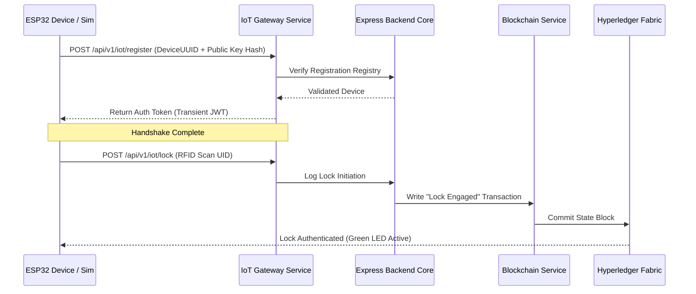

# Device Layer & IoT Edge Architecture Document
## ESP32 Smart Organ Transport Box & First-Class Digital Twin Simulator

This document specifies the hardware components, digital twin simulator, interface contracts, environmental simulation engines, replay modes, and communication protocols for the Device Layer.

---

## 1. Device Layer Overview & Abstraction Design
To achieve hardware independence and enable parallel development, the platform uses a **Hardware Abstraction Layer (HAL)**. The core application services interface with devices exclusively through a standardized **Virtual Device Interface**.

```
                           Core Application Services
                          (API Gateway / IoT Service)
                                       │
                                       ▼
                         [ Virtual Device Interface ]
                                       │
         ┌───────────────────┬─────────┴─────────┬───────────────────┐
         ▼                   ▼                   ▼                   ▼
     [Simulator]      [Test Device]      [Replay Device]     [ESP32 Hardware]
     (Node.js Sim)    (Mock Hardware)    (Historical Logs)   (C++ / FreeRTOS)
```

### The Virtual Device Interface Contract
Any device layer implementation (virtual or physical) must implement the following TypeScript-style interface:

```typescript
interface VirtualDevice {
  connect(gatewayUrl: string): Promise<boolean>;
  authenticate(deviceUuid: string, privateKeyHash: string): Promise<string>; // returns JWT
  sendTelemetry(payload: TelemetryPayload): Promise<TelemetryResponse>;
  sendAlert(alert: AlertPayload): Promise<AlertResponse>;
  heartbeat(): Promise<void>;
  syncOfflineLogs(logs: TelemetryPayload[]): Promise<SyncResponse>;
}
```

This abstraction ensures that the backend and dashboard operate identically whether talking to a local software mock, a testing script, a replayed log file, or physical hardware.

---

## 2. Simulation Architecture as a First-Class Citizen
The simulator is not a temporary stub; it is built as a **first-class citizen** within the project repository to support automated testing, CI/CD pipelines, training, and hardware-free demonstrations.

### Simulation Folder Structure
```text
simulation/
│
├── engine/                  # Core simulation loop, clock controllers, and state machine
│
├── scenarios/               # Standardized state transitions for testing
│   ├── normal-route.json
│   ├── temperature-breach.json
│   ├── tamper.json
│   ├── battery-low.json
│   ├── traffic-delay.json
│   └── airport-transfer.json
│
├── routes/                  # GPS route waypoints (coordinates, expected transit times)
│   ├── raipur-to-nagpur.json
│   └── aiims-to-airport.json
│
├── devices/                 # Device class implementations (VirtualDevice instances)
│   ├── simulated-box.js
│   └── replay-box.js
│
├── replay/                  # Reads historic database files and replays them
│   └── log-replayer.js
│
├── payloads/                # Validation schemas for JSON telemetry packets
│
└── README.md
```

---

## 3. Environmental & Scenario Simulation Engines

### Environmental Modeling
The **Environmental Simulation Engine** models changing physical contexts during transit (e.g., transport from Raipur AIIMS ──> Airport ──> Flight ──> Nagpur Hospital). It dynamically adjusts:
*   **GPS & Speed**: Moves coordinates along route vectors, calculating speeds, simulated traffic delays, and altitude-induced network drops.
*   **Temperature**: Models gradual thermal dynamics (e.g. ambient temperature shifts, ice melt rates, insulation quality).
*   **Battery Drain**: Simulates power usage based on device states (higher drain when GPS/WiFi search is active, lower drain in standby).
*   **ETA Updates**: Recalculates estimated arrivals based on simulated speed, route progress, and traffic delays.

### Scenario Schema Configuration (`scenarios/*.json`)
Scenarios define initial environmental parameters and trigger events to test system behavior:
```json
{
  "scenarioName": "Airport Transfer with Temp Breach",
  "durationSeconds": 3600,
  "gpsRoute": "aiims-to-airport",
  "battery": {
    "startPercentage": 98.0,
    "drainRatePerSec": 0.001
  },
  "temperature": {
    "startCelsius": 3.8,
    "ambientCelsius": 32.0,
    "thermalConductivity": 0.05
  },
  "eventTriggers": [
    {
      "triggerAtSeconds": 900,
      "eventType": "INSULATION_FAILURE",
      "value": 0.35
    },
    {
      "triggerAtSeconds": 1800,
      "eventType": "UNAUTHORIZED_LID_OPEN",
      "value": true
    }
  ]
}
```

---

## 4. Replay Mode Architecture
Replay Mode allows developer and audit teams to replay historic transport logs (e.g., replicating a past mission that suffered a cold-chain breach):

```
[ Historical Mission Log (MongoDB) ] ──> [ Log Replayer ] ──> [ Replay Device Class ]
                                                                      │
                                                                      ▼
                                                            [ Gateway Interface ]
                                                                      │
                                                                      ▼
                                                            [ Realtime Dashboard ]
```

### Key Replay Features
*   **Time-Scaled Execution**: Replay data at 1x, 2x, 5x, or 10x speed.
*   **Audit Analysis**: Allows inspectors to replay a compromised transport run step-by-step to analyze sensor events and locate the exact point of failure.

---

## 5. Hardware Component Specification (Physical Implementation)
When deployed on physical hardware, the device uses the following components:
*   **Microcontroller**: ESP32-WROOM-32D (Dual-core Tensilica LX6, 240MHz, 520KB SRAM, 4MB Flash). Dual-core operation separates sensor reading tasks from network synchronization processes.
*   **DS18B20 Temperature Sensor**: High-accuracy digital thermometer operating over a 1-Wire bus.
*   **NEO-6M GPS Module**: Coordinates with satellite networks via hardware UART interface to transmit location coordinates.
*   **RC522 RFID Reader**: Reads 13.56 MHz tags (such as transport crew badges) over an SPI interface to authenticate lock/unlock actions.
*   **Reed Switch (Tamper Sensor)**: A magnetic sensor placed on the box lid interface. A break in the magnetic connection triggers an interrupt-driven tamper alarm.
*   **Buzzer & RGB Status LEDs**: Provide local audio-visual feedback (e.g. solid green for normal operation, flashing red for alarms).
*   **Power Supply**: A 3.7V 18650 Li-ion rechargeable battery pack providing up to 24 hours of operation under active tracking.

---

## 6. Offline Ring Buffer & Connectivity Handling
To protect data during network drops, both the physical device and the simulator implement an offline queue manager:
*   **Physical (Flash Memory)**: Stores logs in its onboard SPIFFS flash memory.
*   **Simulator (Memory Array)**: Caches records in an in-memory queue array.
*   **Sync Rules**: Telemetry is buffered in a FIFO ring queue (up to 2,000 entries). When connection is restored, logs are uploaded to `/api/v1/iot/telemetry/sync` in chunks of 50 to prevent gateway timeout errors.

---

## 7. Edge-to-Gateway Handshake & Verification



---

## 8. Sensor Data Format Schema (JSON Payloads)

Both simulated and physical devices use the same JSON payload structures:

### 1. Standard Telemetry Log (Device to Gateway)
```json
{
  "deviceUuid": "ESP32-BOX-7789A",
  "timestamp": 1784634890,
  "payload": {
    "temperature": 3.8,
    "gps": {
      "latitude": 28.5672,
      "longitude": 77.2104,
      "speedKnots": 34.5,
      "satellites": 9
    },
    "batteryPercentage": 92.4,
    "tamperDetected": false,
    "rssi": -68
  }
}
```

### 2. Alert Event Log (Device to Gateway)
```json
{
  "deviceUuid": "ESP32-BOX-7789A",
  "timestamp": 1784635200,
  "alert": {
    "type": "TAMPER_LID_OPENED",
    "details": "Lid switch triggered without RFID authorization",
    "currentTemperature": 4.1,
    "coordinates": [28.5672, 77.2104]
  }
}
```
