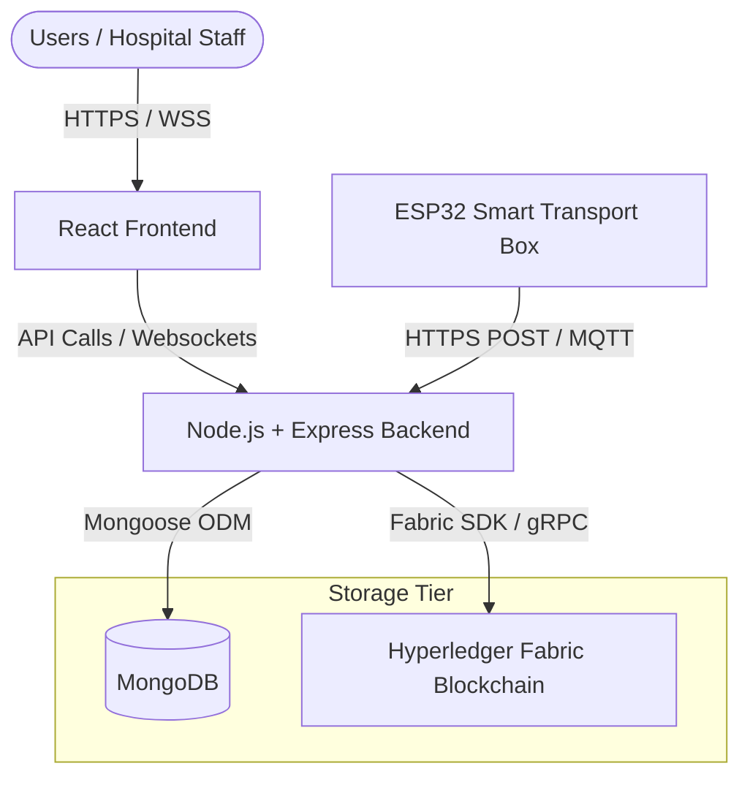
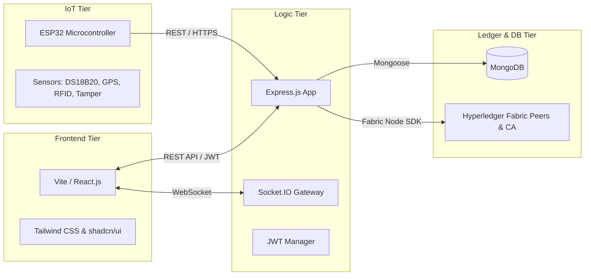
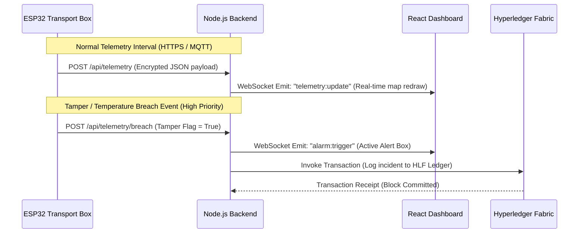

# System Architecture Document
## Blockchain-Enabled Human Organ Transplantation & Smart Organ Transport Platform

This document details the software architecture, system design, and engineering rationale for the Blockchain-Enabled Human Organ Transplantation & Smart Organ Transport Platform.

---

## 1. Project Overview
The procurement and transportation of human organs for transplantation is a high-stakes, time-critical domain plagued by operational inefficiencies, vulnerability to cold-chain excursions, lack of transparency, and susceptibility to unethical allocation. 

This platform provides an end-to-end, enterprise-grade solution that integrates:
*   A **React/Vite Frontend** for real-time visualization and role-based operational management.
*   A **Node.js/Express Backend** acting as the central orchestrator and data aggregator.
*   A **MongoDB Database** for low-latency storage of operational, relational, and non-repudiation-insensitive application states.
*   A **Hyperledger Fabric Blockchain Network** acting as an immutable audit trail and state machine to guarantee compliance with allocation rules (e.g., THOTA guidelines) and prevent tampering.
*   An **ESP32-based Smart Organ Transport Box** providing continuous tracking of environmental parameters (temperature, GPS location, box tampering, battery, and RFID access verification).

By combining these technologies, the system minimizes human error, prevents illicit transplantation, enforces strict temperature and handling compliance, and provides real-time visibility to transplant coordinators and surgical teams.

---

## 2. System Objectives
1.  **Strict Allocation Integrity**: Enforce local and national regulatory guidelines (such as India's THOTA - Transplantation of Human Organs Act) to prevent manual favoritism or queue tampering.
2.  **Immutability and Non-Repudiation**: Ensure that every transaction, status update, match outcome, and log is logged onto a permissioned ledger to provide auditability for regulatory authorities.
3.  **Real-Time Environmental & Location Tracking**: Continuously monitor organ transit parameters to enable alerts for temperature breaches, path deviations, or unauthorized physical box access.
4.  **Zero-Trust Identity Verification**: Ensure that only pre-authorized, authenticated medical and transport personnel can execute transitions (e.g., dispatching, transporting, opening the box).
5.  **Offline Resilience & Eventual Consistency**: Protect telemetry data from network drops during transport, buffering logs locally on the ESP32 and synchronizing them once connectivity is restored.

---

## 3. High-Level Architecture
The system employs a multi-tiered architecture structured around clear separation of concerns, scalability, and physical boundaries:



### Architectural Rationale
*   **Decoupled Frontend/Backend**: Splitting React from Node.js enables independent deployments, caching of static assets on CDNs, and allows the backend to serve as a pure headless API serving both the dashboard and IoT devices.
*   **Dual-Database Hybrid Strategy**: 
    *   *Off-chain (MongoDB)*: Handles fast-read, high-write data (like raw GPS and temperature coordinates, session details, notifications) which would otherwise overwhelm blockchain consensus mechanisms.
    *   *On-chain (Hyperledger Fabric)*: Restricts storage to cryptographic signatures, hash pointer links, allocation order, donor/recipient matching records, and audit events. This maintains ledger compactness and conforms to privacy standards (e.g., GDPR's Right to Be Forgotten) by keeping Personally Identifiable Information (PII) off the ledger.

---

## 4. Component Architecture



### Component Details
1.  **Presentation Component**: Builds on React to render interactive dashboards. React Router handles client-side page routing. Tailwind CSS and `shadcn/ui` supply standard accessibility components.
2.  **Orchestration Component**: Node.js utilizing Express.js. Acts as the Single Point of Contact (SPOC) for client requests, validation rules, and interfacing with external SDKs (MongoDB Mongoose, Hyperledger SDK).
3.  **Real-Time Data Broker**: Socket.IO handles live duplex connections, piping active transport location updates directly from the IoT telemetry service to the active frontend map component.
4.  **Ledger Component**: Hyperledger Fabric peers maintain the channel state, executing Chaincode written in Go or TypeScript to handle critical state transitions.
5.  **Hardware Monitor (IoT)**: An ESP32 microcontroller that polls sensors at a regular frequency, aggregates messages, and executes encrypted payload transfers to the backend.

---

## 5. Frontend Architecture
The frontend is constructed using **Vite** as the build tool for near-instant developer compilation and minimized production builds. 

### Core Tech Stack Decisions
*   **React (Functional Components + Hooks)**: React's state management model allows rapid updating of map coordinates and live charts during active organ transit.
*   **Tailwind CSS**: Promotes utility-first styling, minimizing stylesheet bloat and ensuring quick rendering on mobile devices (useful for transport crews).
*   **shadcn/ui**: Built on top of Radix UI primitives and Tailwind, it enforces strict WAI-ARIA compliance, essential for healthcare administrative systems.

### Directory Structure & Organization
*   `/components`: Reusable layout and UI elements (buttons, inputs, cards, maps, charts).
*   `/pages`: Screen definitions representing the high-level dashboard views (Dashboard, LiveTrack, Matching, Verification).
*   `/context`: Global application state stores (Authentication state, Socket connection pools).
*   `/services`: API wrappers utilizing Axios for backend communication.
*   `/hooks`: Custom hooks containing state handling logic (e.g., `useSocket`, `useAuth`).

---

## 6. Backend Architecture
The backend application follows a standard layered architecture pattern to keep application logic decoupled from HTTP request frameworks.

```
Request ──> Router ──> Middleware (Auth/RBAC) ──> Controller ──> Service ──> Data Tier (DB/Fabric)
```

### Architectural Layers
1.  **Routing Layer (`/routes`)**: Maps endpoints to designated controller methods. Strictly handles URL parameters and simple query-string parser routing.
2.  **Controller Layer (`/controllers`)**: Sanitizes HTTP input payloads, delegates business workflows to the services layer, and structures standardized HTTP responses.
3.  **Services Layer (`/services`)**: Contains the core business rules of the platform (e.g., logic matching algorithms, blockchain interface queries). It remains independent of Express Request/Response objects.
4.  **Models Layer (`/models`)**: Defines Mongoose Schemas representing backend databases.
5.  **Blockchain Layer (`/blockchain`)**: Contains wrapper functions using the official Fabric SDK to build, sign, and submit transactions to the Peer network.

---

## 7. Database Responsibilities
The system uses **MongoDB** as its relational-like transactional store.

### Key Database Functions
*   **Telemetry Buffer**: Houses thousands of sensor updates per transport run. Doing this on the ledger is cost-prohibitive and leads to bloat; MongoDB documents store arrays of coordinates and sensor metrics mapped to a specific transport session ID.
*   **User Sessions & Operations**: Stores user metadata, password hashes, operational logs, system configuration parameters, and dashboard preferences.
*   **Caching Layer**: Caches blockchain-verified record states to reduce gRPC fetch latency for dashboard lists.

### Indexing & Schema Integrity
*   Compound Indexes are placed on `[transportId, timestamp]` inside telemetry collections to allow rapid retrieval of historic transport route lines.
*   Unique indexes on Email and Medical License numbers ensure data integrity at the database layer.

---

## 8. Blockchain Responsibilities
The **Hyperledger Fabric (HLF)** blockchain functions as the Single Source of Truth for system transitions that demand legal auditability and cryptographic trust.

```
       [Hospital registers request] 
                    │ (Transaction 1: Record Match Entry)
                    ▼
           [Organ matching run] 
                    │ (Transaction 2: Algorithm Proof & Final Priority Queue)
                    ▼
            [Transport start] 
                    │ (Transaction 3: Cryptographic Handshake by RFID)
                    ▼
        [Active sensor boundaries] 
                    │ (Transaction 4: Final transit report / cold-chain audit)
                    ▼
           [Organ delivery] 
                    │ (Transaction 5: Final recipient sign-off)
```

### Ledger vs. Database Split
| Parameter / Field | Database (MongoDB) | Blockchain (Hyperledger Fabric) |
| :--- | :--- | :--- |
| **Personal Identifiable Info (PII)** | Yes (Names, emails, phone numbers) | No (Only UUID hashes of donors/recipients) |
| **Telemetry (GPS/Temp/Battery)** | Raw data stream (every 5-10 seconds) | Out-of-bounds events & final trip digest hash |
| **Transition Logs (Dispatch/Receive)**| Cache storage | Immutable State Transition Ledger (Signed) |
| **Algorithm Weights / Matching Queue**| Raw calculations | Output priority state & verification hash |

### Key Fabric Network Configurations
*   **Organizations**: Separate Org identities for national authorities (NOTTO), state-level bodies (SOTTO), and participating hospitals.
*   **Consensus (Raft)**: Crucial for sub-second transaction finality, ensuring zero fork risk, which is a major drawback of public blockchains like Ethereum.

---

## 9. IoT Responsibilities
The **ESP32** transport box acts as an edge-computing sentinel. It monitors the environment and ensures physical package security.

```
                               ┌─────────────┐
                               │    ESP32    │
                               └──────┬──────┘
                                      │
            ┌─────────────────────────┼─────────────────────────┐
            │                         │                         │
      ┌─────▼─────┐             ┌─────▼─────┐             ┌─────▼─────┐
      │  Sensors  │             │ Security  │             │ Indicators│
      └───────────┘             └───────────┘             └───────────┘
     - Temp (DS18B20)         - RFID (RC522)            - Buzzer (Alarm)
     - GPS (NEO-6M)           - Reed Switch (Tamper)    - RGB Status LEDs
```

### Microcontroller System Flow
1.  **Sensor Polling Loop**: Reads temp, GPS, and tamper state every 5 seconds.
2.  **Local Memory Buffer**: In the event of a cellular or Wi-Fi drop, telemetry is stored in the ESP32's non-volatile flash storage using a ring-buffer algorithm to prevent data loss.
3.  **Active Lock Control**: An RFID scanner (RC522) reads transport personnel cards. If the card UID matches the session key generated during dispatch, the box can be opened without triggering an alert.
4.  **Alarm System**: If the Reed switch opens (indicating container breach) without matching an authorized RFID card, the ESP32 immediately turns on the local Buzzer and flags the breach event in its next network packet.

---

## 10. Communication Flow
Communication protocols are selected to match bandwidth, latency, and power constraints:



### Protocol Rationale
*   **HTTPS POST (REST)**: Used for initial key handshakes, authentication, and standard configuration settings.
*   **WebSockets (WSS)**: Enables real-time full-duplex pipelines from backend to the dashboard. The frontend does not poll, saving computing resources.
*   **gRPC**: The backend uses gRPC to interface with Hyperledger Fabric nodes. This optimizes performance and guarantees type safety through Protocol Buffers.

---

## 11. Authentication Flow
The system utilizes a secure JWT-based stateless architecture coupled with physical security models at the edge.

```
       [User Login] ────> [Backend validates credentials] ────> [Generates JWT Token]
                                                                        │
        [Bearer authorization header sent in future calls] <────────────┘
```

*   **Token Refresh Cycle**: Short-lived access tokens (15 minutes) coupled with secure, HttpOnly refresh tokens stored in cookies. This prevents Cross-Site Scripting (XSS) from compromising the persistent session.
*   **Hardware Authentication**: The ESP32 is registered on the backend with a unique device identifier and hardware-bound private key. During startup, it registers to retrieve a transient session JWT which is attached to all subsequent telemetry HTTP requests.

---

## 12. Role-Based Access Control (RBAC)
To prevent unauthorized state changes in the transplantation workflow, user accounts are assigned fine-grained privileges:

| Role | Permitted Actions | Excluded Actions |
| :--- | :--- | :--- |
| **Admin** | System configuration, network orchestration, user enrollment, node health | Initiating organ match calculations, editing matching results |
| **NOTTO Coordinator** | Overriding priority allocations under extreme circumstances, auditing national logs | Operating transport boxes, direct hospital operations |
| **Hospital Coordinator** | Registering donors and recipients, entering matching constraints | Dispatching transport vehicles, overriding matching queues |
| **Transplant Doctor** | Declaring organ viability, initiating surgical procedures, completing transplants | Operating transport lock systems, global administration |
| **Transport Team** | Claiming transport tasks, swiping RFID keys to lock/unlock, updating transit logs | Reading patient historical records (HIPAA compliance) |

---

## 13. Module Responsibilities

### 1. Authentication
*   Enrollment and login for all user types.
*   JWT token generation, signature validation, and revocation blacklist.

### 2. Hospital Management
*   Directory of authorized transplant center locations, status indicators, and contact points.

### 3. Donor Management
*   Registration of donors, consent storage, blood typing, tissue profile logging, and organ viability status.

### 4. Recipient Management
*   Patient waitlist registration, medical history tracker, HLA matching characteristics, and geo-location for transit time calculations.

### 5. Organ Registry
*   Catalog of harvested organs, preservation timestamps, cold ischemic time counters, and specific anatomical profiles.

### 6. Organ Matching
*   Executes priority matching algorithm based on tissue matching, HLA cross-matching, logistics, waitlist time, and severity indicators.

### 7. Transplant Workflow
*   State machine orchestrator managing the stages: Harvested ──> Matched ──> Dispatched ──> In Transit ──> Delivered ──> Transplanted.

### 8. Smart Transport
*   Generates transport session IDs, maps active courier assignments, sets up geofence thresholds, and monitors cold chain limits.

### 9. IoT Monitoring
*   Aggregates live sensor data points, routes them to real-time streams, and alerts staff of anomalous conditions.

### 10. Blockchain Audit
*   Submits logs to HLF nodes and retrieves cryptographic proofs to build verify-history screens.

### 11. Reports & Analytics
*   Compiles summary records (such as average transit times, organ discard rates, and system compliance metrics) for review.

### 12. Administration
*   Provides user profile management, security logging dashboards, and configuration parameters.

---

## 14. Data Flow

```
                      [ Harvesting Complete ]
                                 │
                                 ▼
                     [ Run Matching Algorithm ]
                                 │
                                 ▼
              [ Dispatch & Link ESP32 to Session ]
                                 │
                                 ▼
         [ Active Transport (Live Telemetry & Alert Checks) ]
                                 │
                                 ▼
                       [ Destination Hospital ]
                                 │
                                 ▼
                       [ Recipient Delivery ]
```

### Detailed Execution Sequence
1.  **Harvest Step**: A surgeon logs organ harvest completion. The backend saves details in MongoDB and generates a secure ledger ID.
2.  **Matching Engine**: The backend runs the priority algorithm. The output candidate list is locked onto the blockchain channel ledger.
3.  **Transit Initialization**: The transport box RFID card is associated with the transit ID. The ledger marks the transition as "Dispatched".
4.  **Transit Phase**: Telemetry is streamed to the backend. The backend validates temperature thresholds. If a threshold is violated, notifications are routed to the frontend map, and the breach is recorded on the ledger.
5.  **Receiving Phase**: The receiving surgeon taps their RFID card, unlocking the box. The final transit digest is uploaded, checked for compliance, and marked "Delivered".

---

## 15. Security Architecture
The platform is designed around strict security guidelines for both software and hardware interfaces:

*   **Encryption at Rest & Transit**: Databases are encrypted using AES-256. Web traffic uses TLS 1.3, and MQTT and websocket streams run over secure layers (WSS, MQTTS).
*   **Hardware Anti-Tampering**: ESP32 firmware limits network connections to pre-configured domains. A hardware tamper switch detects physical open actions, generating log entries that cannot be modified by local network users.
*   **HIPAA & Privacy Isolation**: Personally Identifiable Information (PII) is kept out of public structures. Blockchain registers use UUIDs, which references encrypted entries stored in the database.

---

## 16. Deployment Architecture
The platform is containerized to ensure consistent operation across local, testing, and production servers.

```
                           [ HTTPS / WSS Traffic ]
                                      │
                                      ▼
                        [ Nginx Reverse Proxy / SSL ]
                                      │
              ┌───────────────────────┴───────────────────────┐
              │                                               │
      ┌───────▼───────┐                               ┌───────▼───────┐
      │   React App   │                               │  Express App  │
      │  (Container)  │                               │  (Container)  │
      └───────────────┘                               └───────┬───────┘
                                                              │
                                      ┌───────────────────────┴───────────────────────┐
                                      │                                               │
                              ┌───────▼───────┐                               ┌───────▼───────┐
                              │  MongoDB Res  │                               │  Fabric Peer  │
                              │  (Container)  │                               │  (Container)  │
                              └───────────────┘                               └───────────────┘
```

### Infrastructure Components
*   **Nginx**: Acts as the reverse proxy, load balancer, and SSL termination node.
*   **PM2 Orchestrator**: Manages Node.js app processes to automatically restart on unhandled failures.
*   **Docker Volumes**: Ensures persistent storage for MongoDB data directories and Fabric cryptographic folders.

---

## 17. Docker Architecture
The development and production configurations are managed via **Docker Compose**, separating components into distinct virtual networks:

```
[ frontend-net ] ────> React Container
                          │
                          ▼
[ backend-net ]  ────> Express Service Container
                          │
            ┌─────────────┴─────────────┐
            ▼                           ▼
       MongoDB Container        Fabric Network Container
```

*   **Network Segmentation**: The frontend container cannot directly access MongoDB or Fabric. This prevents potential database attacks from compromised clients.
*   **Volume Mounts**: Fabric CA and peer state storage folders map to secure host volumes to prevent data loss when container instances restart.

---

## 18. Scalability Considerations
*   **Database Sharding**: MongoDB collections are sharded based on `transportId` values, distributing telemetry payloads across multiple physical servers.
*   **Stateless Backend Scaling**: Because the backend uses stateless JWTs rather than session storage, multiple Express instances can run behind the reverse proxy.
*   **Fabric Channel Partitioning**: As the hospital network grows, channels can be partitioned by state or region, limiting transaction processing loads to relevant peers.

---

## 19. Future Enhancements
*   **Offline Cryptographic Logs**: Implementing BLE (Bluetooth Low Energy) protocols to allow transport crews to check box metrics even in remote areas without cellular coverage.
*   **Zero-Knowledge Matching Proofs**: Using Zero-Knowledge proofs to verify recipient queue selection logic on the blockchain without sharing sensitive personal health information.
*   **Advanced IoT Diagnostics**: Integrating battery life analysis algorithms on the ESP32 to predict energy usage patterns during complex, multi-modal transport paths.

---

## 20. Architecture Decisions and Design Rationale

### 1. Choice of Hyperledger Fabric over Ethereum/Polygon
*   **Rationale**: Public networks introduce variable transaction fee costs (gas) and lack true data privacy. Hyperledger Fabric provides a permissioned environment with zero gas fees, private data collections, and high throughput.

### 2. Hybrid Database Strategy (MongoDB + Fabric)
*   **Rationale**: Fabric is not designed for high-frequency telemetry storage. Using MongoDB as a storage engine for coordinate data streams while referencing hashes on the blockchain ledger ensures optimal performance and lower storage overhead.

### 3. ESP32 Edge Computations
*   **Rationale**: The ESP32 manages lock control, battery monitoring, and sensor processing locally. This ensures that safety operations (like the audio alarms) execute immediately even during wireless network drops.
