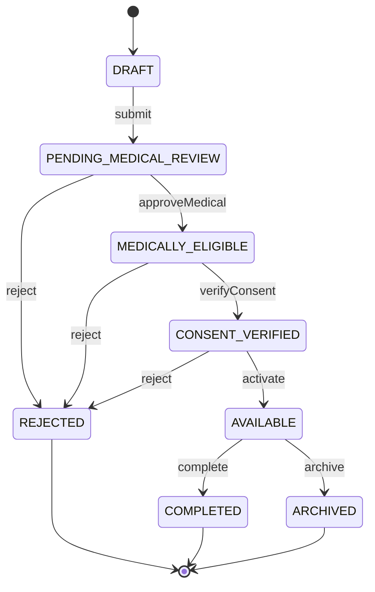

# Sprint 4: Donor Module Implementation Plan

This document outlines the architecture, workflow, permissions, and API endpoints for the Donor Module (Sprint 4). As recommended, it separates the Donor identity, consent, and medical eligibility, while strictly avoiding direct linkages to the Organ module. It also includes the workflow engine refactoring to create a formalized common interface.

---

## 1. Architectural Refinements: Workflow Engine

Before writing Donor code, we will formalize the generic workflow engine.

### Proposed Structure
```text
backend/src/workflow/
├── index.js           (Public API exports)
├── stateMachine.js    (Core engine logic)
├── types.js           (JSDoc definitions for TransitionMap contracts)
├── README.md          (Documentation for future developers)
└── transitions/
    └── hospital.transitions.js
```

By exporting from `index.js`, modules will cleanly import `createStateMachine` and `WORKFLOW_ERRORS` without needing to know internal paths.

---

## 2. Donor Domain Model

The `Donor` schema will be strictly partitioned into three logical subdomains. **Organs will not be referenced here**—that relationship belongs in the future Organ module.

### Subdomains
- **Donor Identity**: `donorId` (Auto-generated like `hospitalCode`), `hospitalId` (Reference to Hospital), `donorType` (LIVING, DECEASED), `bloodGroup`, `age`, `gender`, `medicalSummary`
- **Consent**: `consentType` (LIVING_DONOR, FAMILY_AUTHORIZATION), `consentStatus` (PENDING, VERIFIED, REJECTED), `consentTimestamp`, `witness` (name, relationship)
- **Medical Eligibility**: `assessmentStatus` (PENDING, ELIGIBLE, TEMPORARILY_DEFERRED, REJECTED), `assessmentNotes`, `assessedBy` (User ref)

### Base Fields
- `status` (Workflow State)
- `createdBy` (User ref)
- `version` (Optimistic concurrency)
- `timestamps`

---

## 3. Donor Workflow & State Machine

The donor lifecycle involves both medical and consent-based steps.

### Allowed States
`DRAFT`, `PENDING_MEDICAL_REVIEW`, `MEDICALLY_ELIGIBLE`, `CONSENT_VERIFIED`, `AVAILABLE`, `COMPLETED`, `REJECTED`, `ARCHIVED`

### Valid Transitions Matrix

| From | Action | To | Description |
|------|--------|-----|-------------|
| `DRAFT` | `submit` | `PENDING_MEDICAL_REVIEW` | Submitted for medical assessment |
| `PENDING_MEDICAL_REVIEW` | `approveMedical` | `MEDICALLY_ELIGIBLE` | Medically cleared for donation |
| `PENDING_MEDICAL_REVIEW` | `reject` | `REJECTED` | Medically ineligible |
| `MEDICALLY_ELIGIBLE` | `verifyConsent` | `CONSENT_VERIFIED` | Legal/family consent confirmed |
| `MEDICALLY_ELIGIBLE` | `reject` | `REJECTED` | Consent denied |
| `CONSENT_VERIFIED` | `activate` | `AVAILABLE` | Ready for organ registration |
| `CONSENT_VERIFIED` | `reject` | `REJECTED` | Activated but later rejected |
| `AVAILABLE` | `complete` | `COMPLETED` | Organ recovery process finished |
| `AVAILABLE` | `archive` | `ARCHIVED` | Donor archived (e.g. timeout/change of mind) |



---

## 4. RBAC & Permissions

A new `src/permissions/donor.permissions.js` will define:

- `donor:create` (Hospital Coordinator)
- `donor:view` (All Officers, Surgeons, Auditors)
- `donor:update` (Hospital Coordinator)
- `donor:submit` (Hospital Coordinator)
- `donor:medicalReview` (Transplant Surgeon, Hospital Coordinator)
- `donor:verifyConsent` (Hospital Coordinator, NOTTO Officer)
- `donor:activate` (Hospital Coordinator, NOTTO Officer)
- `donor:archive` (NOTTO Officer)

---

## 5. API Specification

All routes nested under `/api/v1/donors`.

### CRUD Endpoints
- `POST /` - Create Draft Donor
- `GET /` - List Donors (with filters for status, bloodGroup, hospitalId, pagination)
- `GET /:id` - Get single Donor
- `PATCH /:id` - Update Draft Donor

### Workflow Endpoints
- `POST /:id/submit`
- `POST /:id/medical-approve`
- `POST /:id/consent-verify`
- `POST /:id/activate`
- `POST /:id/reject` (Requires rejection reason)
- `POST /:id/complete`
- `POST /:id/archive`

All requests will be validated by Zod schemas in `donor.validator.js`.

---

## 6. Audit Events

Every state change will emit a structured audit log using the same pattern established in Sprint 3.

- `DONOR_CREATED`
- `DONOR_UPDATED`
- `DONOR_SUBMITTED`
- `DONOR_MEDICAL_APPROVED`
- `DONOR_CONSENT_VERIFIED`
- `DONOR_ACTIVATED`
- `DONOR_REJECTED`
- `DONOR_COMPLETED`
- `DONOR_ARCHIVED`

---

## 7. Verification Plan

### Automated Tests
- Extend `workflow.stateMachine.test.js` to cover `donorMachine`.
- Ensure all 9 transitions evaluate correctly and invalid ones are blocked.

### Documentation
- Create a comprehensive Bruno collection for all Donor routes.
- Update `README.md` to mark Sprint 4 active.
