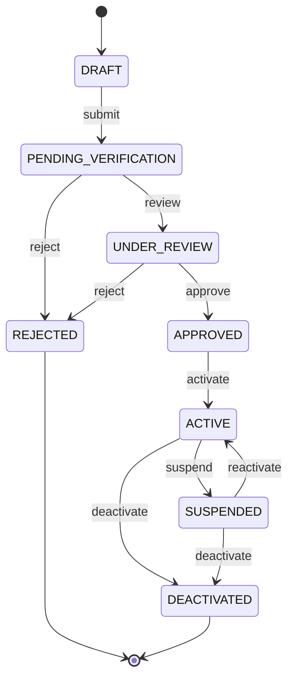

# Sprint 3: Hospital Module Implementation Plan

The sole focus of this sprint is the Hospital domain. No authentication changes, no organ matching, no transport logic.

---

## 1. Folder Structure

```text
backend/src/
├── hospital/
│   ├── controllers/
│   │   └── hospital.controller.js
│   ├── services/
│   │   └── hospital.service.js
│   ├── routes/
│   │   └── hospital.route.js
│   ├── validators/
│   │   └── hospital.validator.js
│   ├── dto/
│   │   └── hospital.dto.js
│   └── tests/
│       └── hospital.test.js
├── models/
│   └── Hospital.js
```

Authentication (`User`) is separate. The `Hospital` model references `User` by ObjectId — it does not embed user fields.

---

## 2. Hospital Lifecycle

```text
DRAFT
  │
  └─ [submit] ──→ PENDING_VERIFICATION
                        │
                  [NOTTO reviews]
                        │
               ┌────────┴────────┐
         [approve]           [reject]
               │                 │
           ACTIVE            REJECTED
               │
         [suspend]
               │
          SUSPENDED
               │
         [reactivate]
               │
            ACTIVE
               │
         [deactivate]
               │
          DEACTIVATED
```

### Status Definitions

| Status | Meaning |
|--------|---------|
| `DRAFT` | Created but not yet submitted for review |
| `PENDING_VERIFICATION` | Submitted — awaiting NOTTO/Admin review |
| `UNDER_REVIEW` | Actively being reviewed (optional manual flag by reviewer) |
| `APPROVED` | Verified by NOTTO — pending final activation |
| `ACTIVE` | Fully operational and visible to the platform |
| `SUSPENDED` | Temporarily halted by Admin — all operations paused |
| `REJECTED` | Disapproved by NOTTO/Admin with a required reason |
| `DEACTIVATED` | Permanently closed — soft-deleted, not removed from DB |

### Valid Transitions

| From | Action | To |
|------|--------|-----|
| `DRAFT` | `submit` | `PENDING_VERIFICATION` |
| `PENDING_VERIFICATION` | `review` | `UNDER_REVIEW` |
| `UNDER_REVIEW` | `approve` | `APPROVED` |
| `UNDER_REVIEW` | `reject` | `REJECTED` |
| `APPROVED` | `activate` | `ACTIVE` |
| `ACTIVE` | `suspend` | `SUSPENDED` |
| `SUSPENDED` | `reactivate` | `ACTIVE` |
| `ACTIVE` | `deactivate` | `DEACTIVATED` |
| `SUSPENDED` | `deactivate` | `DEACTIVATED` |

### Allowed Actions Per State

| Status | Allowed Actions |
|--------|----------------|
| `DRAFT` | `submit` |
| `PENDING_VERIFICATION` | `review`, `reject` |
| `UNDER_REVIEW` | `approve`, `reject` |
| `APPROVED` | `activate` |
| `ACTIVE` | `suspend`, `deactivate` |
| `SUSPENDED` | `reactivate`, `deactivate` |
| `REJECTED` | *(none — terminal state)* |
| `DEACTIVATED` | *(none — terminal state)* |



---

## 3. Hospital Registration Workflow

```text
Hospital Coordinator / NOTTO Officer registers hospital
                ↓
Validation (Zod schema)
                ↓
Save as DRAFT
                ↓
Coordinator submits → PENDING_VERIFICATION
                ↓
NOTTO/Admin reviews → UNDER_REVIEW (optional)
                ↓
          ┌─────┴─────┐
       Approve       Reject (with reason)
          ↓               ↓
      APPROVED         REJECTED
          ↓
      Activate
          ↓
       ACTIVE
```

---

## 4. Database Schema

Authentication data (`User`) is separate. Hospital stores only domain-specific identity and administration fields.

```text
Hospital
├── hospitalCode            String  required, unique  (e.g., "HOS-MUM-001", auto-generated)
├── name                    String  required
├── registrationNumber      String  required, unique   (government-issued)
├── licenseNumber           String  optional
├── nabh                    Boolean default: false     (NABH accreditation flag)
├── hospitalType            Enum    [GOVERNMENT, PRIVATE, TRUST, AUTONOMOUS]
├── transplantCapabilities  Array   [KIDNEY, LIVER, HEART, LUNG, CORNEA, PANCREAS, INTESTINE]
│
├── address
│   ├── street              String  required
│   ├── city                String  required
│   ├── state               String  required
│   ├── pincode             String  required  (6-digit)
│   └── country             String  default: "India"
│
├── geoLocation
│   ├── type                String  default: "Point"
│   └── coordinates         [longitude, latitude]  (for future map features)
│
├── contact
│   ├── phone               String  required  (10-digit)
│   ├── email               String  required  (valid email)
│   └── website             String  optional
│
├── documents               Array of { documentType, url, uploadedAt }
│   └── documentType        Enum    [REGISTRATION_CERT, LICENSE, NABH_CERT, COORDINATOR_ID, OTHER]
│
├── status                  Enum    [DRAFT, PENDING_VERIFICATION, UNDER_REVIEW, APPROVED, ACTIVE,
│                                    SUSPENDED, REJECTED, DEACTIVATED]
│                           default: DRAFT
├── rejectionReason         String  required when status = REJECTED
│
├── createdBy               ObjectId → User   (who registered the hospital)
├── approvedBy              ObjectId → User   (who approved — NOTTO/Admin)
├── approvedAt              Date
│
├── createdAt               Date  (auto)
└── updatedAt               Date  (auto)
```

---

## 5. API Endpoints

| Method | Endpoint | Permission | Description |
|--------|----------|-----------|-------------|
| `POST` | `/api/v1/hospitals` | `hospital:create` | Create hospital (saves as DRAFT) |
| `GET` | `/api/v1/hospitals` | `hospital:view` | List hospitals (paginated, filterable by status) |
| `GET` | `/api/v1/hospitals/:id` | `hospital:view` | Get single hospital |
| `PATCH` | `/api/v1/hospitals/:id` | `hospital:update` | Update hospital fields (DRAFT only) |
| `POST` | `/api/v1/hospitals/:id/submit` | `hospital:submit` | Submit DRAFT → PENDING_VERIFICATION |
| `POST` | `/api/v1/hospitals/:id/approve` | `hospital:approve` | Approve → APPROVED |
| `POST` | `/api/v1/hospitals/:id/reject` | `hospital:reject` | Reject with required reason |
| `POST` | `/api/v1/hospitals/:id/activate` | `hospital:approve` | Activate → ACTIVE (post-approval) |
| `POST` | `/api/v1/hospitals/:id/suspend` | `hospital:suspend` | Suspend ACTIVE hospital |
| `POST` | `/api/v1/hospitals/:id/reactivate` | `hospital:suspend` | Restore SUSPENDED → ACTIVE |
| `POST` | `/api/v1/hospitals/:id/deactivate` | `hospital:deactivate` | Permanently deactivate |

---

## 6. Permission Constants (to be added to `hospital.permissions.js`)

These extend the existing file in `src/permissions/hospital.permissions.js`:

```js
SUBMIT:     'hospital:submit'
REJECT:     'hospital:reject'
DEACTIVATE: 'hospital:deactivate'
```

### Updated RBAC Matrix

| Role | Create | View | Update | Submit | Approve | Reject | Suspend | Deactivate |
|------|:------:|:----:|:------:|:------:|:-------:|:------:|:-------:|:----------:|
| PLATFORM_ADMIN | ✅ | ✅ | ✅ | ✅ | ✅ | ✅ | ✅ | ✅ |
| NOTTO_OFFICER | ✅ | ✅ | ❌ | ✅ | ✅ | ✅ | ❌ | ❌ |
| ROTTO_SOTTO_OFFICER | ❌ | ✅ | ❌ | ❌ | ❌ | ❌ | ❌ | ❌ |
| HOSPITAL_COORDINATOR | ✅ | ✅ | ✅ | ✅ | ❌ | ❌ | ❌ | ❌ |
| TRANSPLANT_SURGEON | ❌ | ✅ | ❌ | ❌ | ❌ | ❌ | ❌ | ❌ |
| AUDITOR | ❌ | ✅ | ❌ | ❌ | ❌ | ❌ | ❌ | ❌ |

---

## 7. Validation Rules

- `name`: min 3, max 200 chars
- `hospitalCode`: auto-generated on creation — not client-supplied
- `registrationNumber`: unique, required
- `hospitalType`: must be a valid enum value
- `address.pincode`: 6-digit Indian PIN code (regex: `/^\d{6}$/`)
- `contact.phone`: 10-digit number (regex: `/^\d{10}$/`)
- `contact.email`: valid email format
- `transplantCapabilities`: at least one required at `submit` time (not at creation)
- `rejectionReason`: required when action is `reject`

---

## 8. Audit Logging

Every state transition must emit a structured log:

```text
HOSPITAL_CREATED
HOSPITAL_SUBMITTED
HOSPITAL_UNDER_REVIEW
HOSPITAL_APPROVED
HOSPITAL_ACTIVATED
HOSPITAL_REJECTED
HOSPITAL_SUSPENDED
HOSPITAL_REACTIVATED
HOSPITAL_DEACTIVATED
```

Format matches the existing logger pattern: `[EVENT]: HospitalCode | Actor: userId`.

---

## 9. Verification Documents

Documents are stored as an array of references. Actual file upload is deferred to a later sprint — at this stage, a URL/path string is sufficient.

| Document Type | Required At Submit |
|---------------|:-----------------:|
| `REGISTRATION_CERT` | ✅ |
| `LICENSE` | ✅ |
| `NABH_CERT` | ❌ (optional) |
| `COORDINATOR_ID` | ✅ |
| `OTHER` | ❌ |

---

## 10. Testing Plan

- `[ ]` Create hospital (DRAFT saved successfully)
- `[ ]` Create hospital (validation failure — missing required fields)
- `[ ]` Create hospital (permission denied for COURIER role)
- `[ ]` Update hospital (success while in DRAFT)
- `[ ]` Update hospital (rejected — not in DRAFT state)
- `[ ]` Submit hospital → PENDING_VERIFICATION
- `[ ]` Submit hospital (permission denied for TRANSPLANT_SURGEON)
- `[ ]` Approve hospital (NOTTO_OFFICER success)
- `[ ]` Approve hospital (HOSPITAL_COORDINATOR denied)
- `[ ]` Reject hospital with reason
- `[ ]` Reject hospital (missing reason — validation fail)
- `[ ]` Activate hospital (PLATFORM_ADMIN)
- `[ ]` Suspend hospital (Admin only)
- `[ ]` Reactivate hospital
- `[ ]` Deactivate hospital (PLATFORM_ADMIN only)
- `[ ]` List hospitals (paginated, filtered by status)

---

## 11. Definition of Done (Sprint 3)

- `[ ]` `Hospital` Mongoose model with all schema fields
- `[ ]` `hospital.permissions.js` extended with `SUBMIT`, `REJECT`, `DEACTIVATE`
- `[ ]` `requirePermission.js` updated with new permissions for all roles
- `[ ]` All 11 endpoints implemented with validation
- `[ ]` Workflow state machine enforced (invalid transitions return 409)
- `[ ]` Audit logging on every state transition
- `[ ]` Bruno collection updated (`bruno/Hospitals/`)
- `[ ]` Manual tests pass
- `[ ]` README Milestones section updated
- `[ ]` Documentation committed
