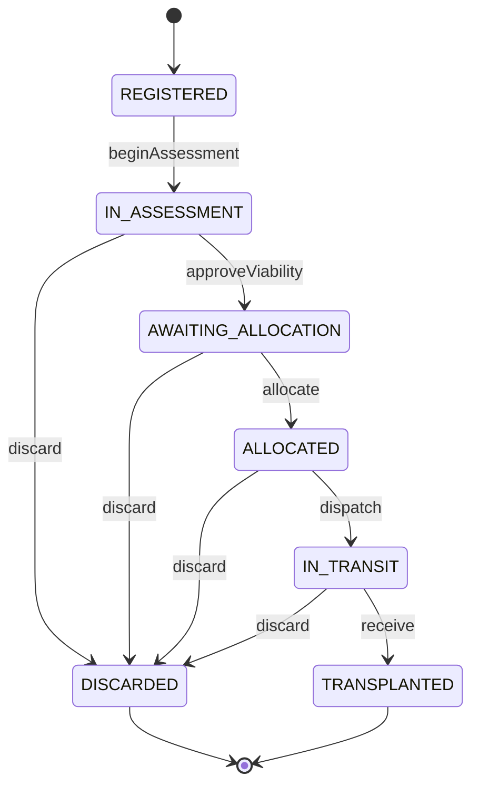

# Sprint 5: Organ Module Implementation Plan

This document outlines the architecture, workflow, permissions, and API endpoints for the Organ Module (Sprint 5). It closely follows the blueprint of separating the organ into four independent concerns: Identity, Medical Assessment, Allocation, and Logistics.

---

## 1. Organ Domain Model

The `Organ` schema will be cleanly partitioned into four logical subdomains.

### Subdomains
- **Organ Identity:** 
  - `organId` (Auto-generated, e.g., `ORG-KID-000001`)
  - `donorId` (Reference to `Donor` schema)
  - `organType` (Enum: `KIDNEY`, `LIVER`, `HEART`, `LUNGS`, `PANCREAS`, `CORNEA`)
  - `bloodGroup` (Copied from Donor for faster querying/matching)

- **Medical Assessment:**
  - `viabilityStatus` (Enum: `PENDING_ASSESSMENT`, `VIABLE`, `MARGINAL`, `NON_VIABLE`)
  - `preservationMethod` (Enum: `STATIC_COLD_STORAGE`, `MACHINE_PERFUSION`)
  - `coldIschemiaTimeLimit` (Number of minutes, depending on organ type)
  - `qualityAssessment` (String/Text for surgeon notes)
  - `assessedBy` (User Ref - Transplant Surgeon)

- **Allocation:**
  - `allocationStatus` (Enum: `UNALLOCATED`, `RESERVED`, `ALLOCATED`)
  - `allocatedToHospital` (Reference to Hospital, if allocated)

- **Logistics (Future-proofing for Sprint 7):**
  - `transportBoxId` (String or Reference for the IoT Box)
  - `transportStatus` (Enum: `NOT_DISPATCHED`, `IN_TRANSIT`, `DELIVERED`)

### Base Fields
- `status` (Workflow State - string)
- `createdBy` (User ref)
- `version` (Optimistic concurrency)
- `timestamps`

---

## 2. Organ Workflow & State Machine

The state machine manages the high-level organ lifecycle using our `workflow/index.js` engine. 

### Allowed States
`REGISTERED`, `IN_ASSESSMENT`, `AWAITING_ALLOCATION`, `ALLOCATED`, `IN_TRANSIT`, `TRANSPLANTED`, `DISCARDED`

### Valid Transitions Matrix

| From | Action | To | Description |
|------|--------|-----|-------------|
| `REGISTERED` | `beginAssessment` | `IN_ASSESSMENT` | Surgeon starts organ evaluation |
| `IN_ASSESSMENT` | `approveViability` | `AWAITING_ALLOCATION` | Organ marked viable for transplant |
| `IN_ASSESSMENT` | `discard` | `DISCARDED` | Organ is non-viable |
| `AWAITING_ALLOCATION`| `allocate` | `ALLOCATED` | Matched with recipient/hospital |
| `AWAITING_ALLOCATION`| `discard` | `DISCARDED` | Broad discard capability (e.g., expiry) |
| `ALLOCATED` | `dispatch` | `IN_TRANSIT` | Organ leaves donor hospital |
| `ALLOCATED` | `discard` | `DISCARDED` | Broad discard capability (e.g., expiry) |
| `IN_TRANSIT` | `receive` | `TRANSPLANTED` | Successfully arrived & transplanted |
| `IN_TRANSIT` | `discard` | `DISCARDED` | Broad discard capability (e.g., expiry) |

---

## 3. RBAC & Permissions

A new `src/permissions/organ.permissions.js` will define:

- `organ:create` (Transplant Surgeon, Hospital Coordinator)
- `organ:view` (All Officers, Surgeons, Auditors, Courier)
- `organ:update` (Transplant Surgeon)
- `organ:assess` (Transplant Surgeon)
- `organ:allocate` (NOTTO Officer, ROTTO Officer)
- `organ:dispatch` (Transport Coordinator, Hospital Coordinator)
- `organ:discard` (Transplant Surgeon, NOTTO Officer)

---

## 4. API Specification

All routes nested under `/api/v1/organs`.

### CRUD Endpoints
- `POST /` - Register Organ (Requires a valid `donorId` in `AVAILABLE` state)
- `GET /` - List Organs (Filters: status, organType, hospital, allocationStatus)
- `GET /:id` - Get single Organ
- `PATCH /:id` - Update Organ Assessment (Only allowed in `IN_ASSESSMENT` state)

### Workflow Endpoints
- `POST /:id/begin-assessment`
- `POST /:id/approve-viability`
- `POST /:id/allocate` (Requires target hospital ID)
- `POST /:id/dispatch` (Requires transport box ID)
- `POST /:id/receive` 
- `POST /:id/discard` (Requires discard reason)

---

## 5. Audit Events

Every state change will emit a structured audit log:

- `ORGAN_REGISTERED`
- `ORGAN_ASSESSMENT_STARTED`
- `ORGAN_VIABILITY_APPROVED`
- `ORGAN_ALLOCATED`
- `ORGAN_DISPATCHED`
- `ORGAN_RECEIVED`
- `ORGAN_DISCARDED`

---

## 6. Verification Plan

### Automated Tests
- Create `organMachine` transition map and add tests in `workflow.stateMachine.test.js`.
- Verify all transitions and guard clauses.

### Documentation
- Create a comprehensive Bruno collection `bruno/Organs/`.
- Update `README.md` to mark Sprint 5 active.
